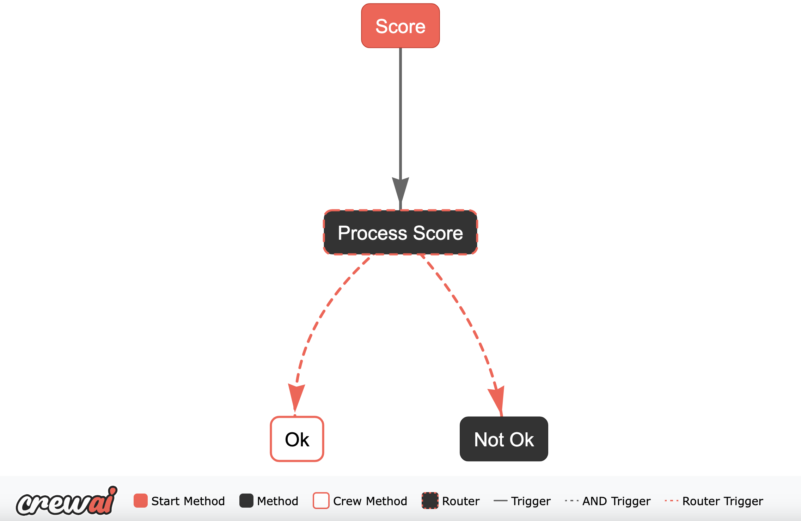

# RFCrew

> [!WARNING]
> This library is currently in development. Use at your own risk.

RFCrew uses AI agents, orchestrated by CrewAI, to streamline the process of creating and evaluating Requests for Comments (RFCs). It helps automate the initial drafting of RFCs from notes and allows comparison between different RFC versions.


## Rationale

Drafting comprehensive RFCs requires significant effort. RFCrew aims to accelerate this process by generating the initial 50-60% of the document using AI, freeing up developers to focus on refinement and implementation details.

> [!WARNING]
> The generated content is AI-based. Output can vary significantly even with small changes to input notes. Always review the generated RFC thoroughly and critically; do not accept it at face value.

## Core Features

*   **RFC Generation:** Creates an initial RFC draft based on provided input notes.
*   **Input Note Scoring:** Assesses the quality and completeness of input notes before generation.
*   **RFC Comparison:** Evaluates the similarity between two RFC documents, focusing on the proposed solutions.

## How it Works

RFCrew utilizes different "crews" (groups of AI agents) for specific tasks:

### Crews

1.  **RFC Generation Crew (`RFCrew`)**:
    *   **Goal:** Generate a complete RFC document from input notes.
    *   **Process:** Employs multiple specialized AI agents working sequentially:
        *   **RFC Research Assistant:** Gathers background information and context using web search tools based on the input notes.
        *   **RFC Author:** Drafts the initial RFC document using the research findings.
        *   **Technical Diagram Illustrator:** Creates a Mermaid syntax diagram visualizing the proposed solution described in the draft.
        *   **Peer Reviewer:** Evaluates the technical soundness and feasibility of the proposed solution, potentially using web search for verification.
        *   **Operational & Risk Assessor:** Assesses potential operational impacts, risks (security, cost, compliance), and readiness requirements, using web search as needed.
        *   **Editor:** Integrates all feedback, refines the text for clarity and consistency, ensures the diagram is included, and finalizes the RFC document.
    *   **Agent Configuration:** Specific roles, goals, backstories, LLMs, and tools for each agent are defined in `config/agents.yaml`.
    *   **Task Configuration:** The sequence and details of tasks performed by these agents are defined in `config/tasks.yaml`.

2.  **Input Note Scorer (`Scorer`)**:
    *   **Goal:** Evaluate the sufficiency of input notes for RFC generation.
    *   **Process:** A single-agent crew assigns a score (1-10) and provides feedback.
    *   **Implementation:** See `src/rfcrew/crews/assessor.py`.

3.  **RFC Evaluator (`Evaluator`)**:
    *   **Goal:** Compare two RFC documents for similarity, particularly their proposed solutions.
    *   **Process:** A single-agent crew provides a similarity score (1-10) and justification. Useful for checking consistency between generated drafts.
    *   **Implementation:** See `src/rfcrew/crews/evaluator.py`.

4.  **RFC to ADR Converter (`Converter`)**:
    *   **Goal:** Convert an RFC document into an Architectural Decision Record (ADR).
    *   **Process:** A single-agent crew extracts the relevant information from the RFC and formats it as an ADR.
    *   **Implementation:** See `src/rfcrew/crews/converter.py`.

### Generation Flow

When using the `generate` command:

1.  **Scoring:** The `Scorer` crew first evaluates the input notes.
2.  **Decision:**
    *   If the score indicates insufficient detail, the feedback and score are printed, and the process stops.
    *   If the notes are deemed sufficient, the flow proceeds to generation.
3.  **Generation:** The `RFCrew` (RFC Generation Crew) executes its sequence of agents and tasks using the notes to create the RFC draft.



## Getting Started

### Installation

1.  **Clone the repository:**
    ```bash
    # Replace with the actual repository URL if different
    git clone https://github.com/JasperHG90/rfcrew.git
    cd rfcrew
    ```

2.  **Install dependencies:**
    *   Using pip:
        ```bash
        pip install .
        ```
    *   Using UV (e.g., within the Dev Container):
        ```bash
        uv sync
        ```

### Configuration

1.  **API Keys:**
    *   **Gemini:** RFCrew uses Google's Gemini models. Obtain an API key from [Google AI Studio](https://ai.google.dev/) and set it as an environment variable:
        ```bash
        export GOOGLE_API_KEY='YOUR_API_KEY'
        ```
    *   **Serper:** The RFC Generation Crew uses Serper for Google search capabilities. Get an API key from [Serper.dev](https://serper.dev/) (free tier available) and set it as an environment variable:
        ```bash
        export SERPER_API_KEY='YOUR_API_KEY'
        ```
    *   **Dev Container:** If using the Dev Container, store these environment variables in `.devcontainer/.env` for automatic loading.

2.  **Agent & Task Configuration:**
    *   Customize the RFC generation process by modifying:
        *   `config/agents.yaml`: Defines agent roles, goals, backstories, tools, and LLMs.
        *   `config/tasks.yaml`: Defines the sequence of tasks, their descriptions, and assigned agents.
    *   Example configuration files are provided in the `config/` directory.
    *   You can specify these file paths via command-line arguments or set the following environment variables:
        ```bash
        export RFCREW_AGENTS_CONFIG='/path/to/your/agents.yaml'
        export RFCREW_TASKS_CONFIG='/path/to/your/tasks.yaml'
        ```

### Development Environment

*   **Dev Container:** A pre-configured development environment is available. If you have VS Code and the Dev Containers extension, you'll be prompted to reopen the project in the container, which installs all necessary tools and dependencies.
*   **Justfile:** Common development tasks are simplified using `just`. Run `just` to see all available commands. Key commands include:
    *   `just install`: Install dependencies using `uv`.
    *   `just setup` / `just s`: Install dependencies and setup pre-commit hooks.
    *   `just test` / `just t`: Run tests using `pytest`.
    *   `just pre_commit` / `just p`: Run pre-commit checks.
    *   `just openlit up`/`down`: Start/stop the OpenLit monitoring stack.
*   **OpenLit Monitoring:**
    *   Track LLM calls, costs, and other metrics using [OpenLit](https://github.com/openlit/openlit).
    *   Start the OpenLit Docker containers: `just openlit up`
    *   Enable tracking by passing the OTLP endpoint when running commands:
        ```bash
        uv run rfcrew --otlp-endpoint=http://127.0.0.1:4318 [command] [args...]
        ```
    *   Access the dashboard at: `http://127.0.0.1:3000`
    *   Credentials: Email `user@openlit.io`, Password `openlituser`
    *   Stop OpenLit: `just openlit down`

## Usage

View all available commands and global options (like `--otlp-endpoint`, `--output-dir`, `--verbose`):

```bash
rfcrew --help
# Or if using uv
uv run rfcrew --help
```

### Examples

Sample input notes and generated RFCs can be found in the `samples/` directory.

**1. Scoring Input Notes:**

Use the `score` command to assess note quality:

```bash
# Example using uv
uv run rfcrew \
    score \
    "samples/bq_write_api/notes/bq_write_api_insufficient.md"
```

*Example Output:*

```
Score: 5
Feedback: The notes provide a clear topic, scope, and a good list of requirements and constraints. The background and context are sufficient to understand the motivation. However, the problem definition could be sharper, focusing more on the specific challenges of using the BQ Write API with Python/Protobuf rather than just stating the need to find the 'best way'. Crucially, there is no evidence of initial research or exploration of potential approaches/alternatives, which is a significant gap for an RFC kick-off. This lack of preliminary investigation necessitates a score below 6.
```

**2. Generating an RFC Draft:**

Use the `generate` command, providing the path to your notes and optionally the agent/task configuration files (or set environment variables).

```bash
# Example using uv, verbose output, OpenLit tracking, and specified config files
uv run rfcrew \
    --verbose \
    --otlp-endpoint=http://127.0.0.1:4318 \
    generate \
    "samples/bq_write_api/notes/bq_write_api_sufficient.md" \
    --agents-config="config/agents.yaml" \
    --tasks-config="config/tasks.yaml"
# Example relying on environment variables for config paths
# export RFCREW_AGENTS_CONFIG='config/agents.yaml'
# export RFCREW_TASKS_CONFIG='config/tasks.yaml'
# uv run rfcrew generate "samples/notes/bq_write_api_sufficient.md"
```


Some generated RFCs are available in the 'samples' directory.

**3. Comparing RFC drafts:**

Use the `compare` command to compare two documents. In particular, this will evaluate whether they describe a similar solution.

```bash
uv run rfcrew \
    compare \
    "samples/bq_write_api/generated/rfc_cream_hedgehog_bq_write_api.md" \
    "samples/bq_write_api/generated/rfc_fiery_tuatara_bq_write_api.md"
```

*Example output:*

```
Score:  7
Feedback::  The two documents propose solutions that are highly similar in their fundamental components and goals but diverge significantly in the specific mechanism used to interact with the BigQuery Write
API, leading to different consistency guarantees and implementation complexities.

**Similarities:**
Both solutions propose using the Google BigQuery Write API via the `google-cloud-bigquery-storage` Python client library to ingest data into BigQuery. Both intend to run the ingestion logic within a Python
application deployed on Google Cloud Run, triggered periodically (e.g., every 10 minutes by Cloud Scheduler). Both mandate the use of Protocol Buffers (Protobuf) for data schema definition and serialization,
and explicitly exclude the use of Google Cloud Pub/Sub as an intermediary.

**Differences:**
1.  **Write API Stream Type:** Document 1 proposes using the **default stream** (`_default`), which is suitable for continuous ingestion and provides at-least-once delivery semantics. Document 2 proposes
creating an **application-managed Committed stream** for each invocation.
2.  **Atomicity and Consistency Guarantee:** Document 1 guarantees row-level atomicity *within* a successful `AppendRows` call but, due to the default stream and potential retries, results in an
**at-least-once** delivery guarantee, meaning duplicates are possible. Document 2 explicitly aims for **exactly-once delivery semantics per Cloud Run invocation** by leveraging client-managed offsets within
the Committed stream.
3.  **Implementation Complexity:** The choice of the Committed stream in Document 2 introduces significant complexity related to **client-managed offset tracking**. The application must correctly assign and
manage sequential offsets for each row/batch within a stream (invocation) to achieve the exactly-once guarantee. Document 1, using the default stream, does not require this complex offset management logic.
4.  **Error Handling Nuances:** While both acknowledge the need for robust error handling, Document 2's strategy must specifically account for errors in the context of client-managed offsets to ensure
correct retries and prevent data loss or duplication, adding another layer of complexity.

In summary, while the core technology stack (BQ Write API, Python, Protobuf, Cloud Run) and the high-level goal (scheduled batch ingestion) are shared, the critical difference lies in the chosen Write API
stream type and the resulting consistency guarantee (at-least-once vs. exactly-once), which fundamentally changes the required client-side logic, particularly the introduction of complex offset management in
Document 2.
```

**4. Converting an RFC to an ADR:**

Use the `convert` command to convert an RFC document to an Architectural Decision Record (ADR).

```bash
uv run rfcrew \
    convert \
    "samples/bq_write_api/generated/rfc_cream_hedgehog_bq_write_api.md" \
    --output-dir "samples/bq_write_api/generated/"
```

## Limitations

*   Currently, only Google Gemini models are supported for generation.
*   Generated Mermaid diagram syntax may sometimes be slightly incorrect and require manual fixing.

## Future Enhancements

*   Integrate memory capabilities (e.g., using [Mem0](https://mem0.ai/)).
*   Allow user selection of different LLMs for various roles (generation, planning, etc.).
*   Expand testing infrastructure.
*   Implement server-side validation for Mermaid MCP syntax.
*   Fine-tune model usage within the crew setup.
*   Support for additional LLM providers.
*   Add "Architect" role with access/MVP to Confluence so that Enterprise/Domain architecture can be included in review process.
