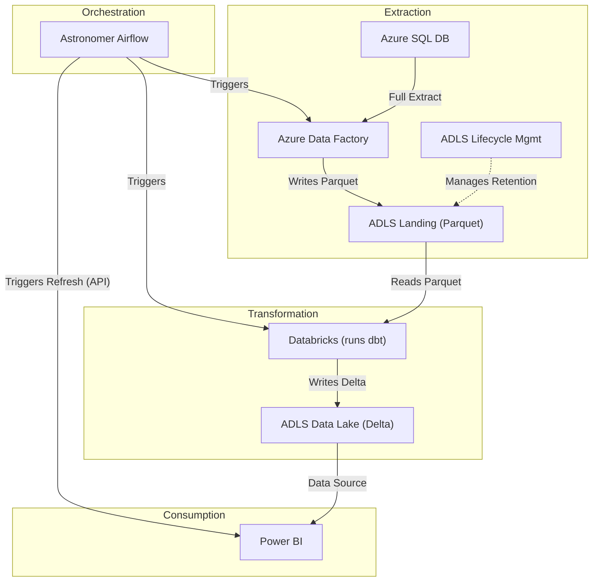

# RFC: Standardized Batch Ingestion from Azure SQL using ADF, Databricks/dbt, and Airflow

## 📜 Table of contents
---
```table-of-contents```

## 🤓 TL;DR;
---
This RFC proposes a standardized, reusable batch ingestion strategy using Azure Data Factory (ADF) for extracting full loads from Azure SQL databases into Azure Data Lake Storage (ADLS) Gen2 as Parquet files. Subsequent transformation into the Delta Lake format within ADLS Gen2 will be performed using Azure Databricks running dbt models. The end-to-end workflow will be orchestrated by Astronomer Airflow, including triggering Power BI dataset refreshes. Azure Storage Lifecycle Management will manage the retention of raw data in the landing zone.

## 🔭 Context and Scope
---
**Background:**
The team requires a defined and repeatable strategy for batch data ingestion, primarily focused on onboarding initial data from common relational database sources like Azure SQL. This RFC establishes the foundational pattern using Azure Data Factory (ADF) for extraction, prioritizing simplicity and suitability for straightforward, full-load scenarios. Incremental loading patterns are considered out of scope for this initial strategy.

**Problem Definition:**
Our client utilizes numerous Azure SQL databases, necessitating a consistent and automated process to:
1.  Extract full table data from source Azure SQL databases using ADF.
2.  Store the extracted raw data reliably in a designated ADLS Gen2 landing zone.
3.  Process and transform this raw data using Azure Databricks and Data Build Tool (dbt).
4.  Store the processed, analysis-ready data in a curated data lake zone within ADLS Gen2.
5.  Trigger downstream actions, specifically Power BI report refreshes, upon successful data processing.
6.  Orchestrate the entire workflow robustly using Astronomer Airflow.

**Scope:**
*   **In Scope:**
    *   Defining a batch ingestion pattern specifically for Azure SQL Server sources.
    *   Handling full table loads only.
    *   Utilizing ADF for the extraction (EL) phase.
    *   Using ADLS Gen2 for both landing (Parquet format) and data lake (Delta Lake format) storage.
    *   Utilizing Azure Databricks and dbt for the transformation (T) phase.
    *   Using Astronomer Airflow for end-to-end orchestration.
    *   Implementing a specific logical path convention for the landing zone data.
    *   Integrating a Power BI dataset refresh trigger post-transformation.
    *   Defining an archiving strategy for landing zone data using native Azure features.
*   **Out of Scope:**
    *   Incremental data loading patterns (e.g., Change Data Capture (CDC), high-watermarking).
    *   Automated handling of schema evolution detected in source systems during ingestion.
    *   Ingestion patterns tailored for non-relational, streaming, or highly complex data sources.

## 🎯 Goals (and Non-Goals)
---
*   **Goals:**
    *   Establish a standardized, repeatable, and maintainable batch ingestion strategy applicable to the majority of initial Azure SQL data sources.
    *   Leverage Azure Data Factory effectively for extracting data from relational sources.
    *   Store raw extracted data in a designated landing zone within ADLS Gen2, using the Parquet format.
    *   Adhere to a consistent logical path convention in the landing zone, proposed as `/data_source/database/schema/table_name/YYYY/MM/DD/*.parquet` (subject to final confirmation, see Discussion).
    *   Process and transform landed data efficiently using Azure Databricks and dbt.
    *   Store transformed, curated data in a data lake zone within ADLS Gen2, using the Delta Lake format for enhanced reliability and query performance.
    *   Orchestrate the complete process using Astronomer Airflow for scheduling, dependency management, and monitoring.
    *   Integrate a reliable mechanism to trigger Power BI report refreshes upon successful data pipeline completion.
    *   Prioritize simplicity and clarity in the solution design for the defined scope (full loads, relational sources).
    *   Define and implement a cost-effective strategy for archiving aged raw data in the landing zone.
*   **Non-Goals:**
    *   Provide built-in support for incremental data loads.
    *   Implement automated schema evolution handling mechanisms.

## 🦉 The Actual Design
---
The proposed design employs a combination of managed Azure services and open-source tools, orchestrated by Airflow, to implement a robust batch ingestion pipeline for Azure SQL data.

**Architecture Overview:**

1.  **Orchestration (Airflow):** Astronomer Airflow DAGs will define, schedule, and manage the sequence of tasks for each ingestion pipeline. DAGs will be heavily parameterized to handle different source tables/databases, promoting reusability.
    <!-- Peer Reviewer Comment: Good approach for reusability. Consider using dynamic DAG generation if the number of tables/sources is very large to avoid manual DAG creation overhead. -->
    <!-- Ops & Risk Comment: Operations: Airflow monitoring and logging are critical. Define how Airflow task failures, retries, and overall DAG health will be monitored (e.g., Airflow UI, metrics endpoint) and alerted on. Plan for integrating Airflow logs with a centralized logging system (e.g., Azure Log Analytics). -->
    <!-- Ops & Risk Comment: Readiness: Ensure the Airflow environment (Astronomer) is correctly sized and configured for the expected workload. Define and implement a CI/CD strategy for DAG code deployment (e.g., Git sync). -->
2.  **Extraction (ADF):** Parameterized ADF pipelines, triggered by Airflow tasks, will perform the extraction. Each pipeline will utilize the `Copy Data` activity to connect to a source Azure SQL database, execute a query to extract a full table load, and write the data to the ADLS Gen2 landing zone.
    <!-- Peer Reviewer Comment: ADF Copy Activity is suitable for this. Ensure appropriate configuration for large tables (e.g., partitioning options, staging via Blob Storage, sufficient DIU allocation). Consider potential performance impact on the Azure SQL source during large extractions. -->
    <!-- Ops & Risk Comment: Operations: Monitor ADF pipeline runs via Azure Monitor and ADF's native monitoring. Track key metrics: run duration, data volume, rows copied, failure rates. Integrate alerts for failures. -->
    <!-- Ops & Risk Comment: Security: Authentication from ADF to Azure SQL and ADLS Gen2 *must* use Managed Identities with least-privilege access roles assigned. Store connection details securely, preferably leveraging Azure Key Vault integration with ADF. -->
    <!-- Ops & Risk Comment: Cost: ADF costs depend on activity runs, DIU-hours, and data movement volume. Optimize pipelines and schedule appropriately to manage costs. -->
3.  **Landing Zone (ADLS Gen2):** ADF will write the extracted data as Parquet files into a designated container within an ADLS Gen2 storage account (with hierarchical namespace enabled). Files will be organized using a consistent convention, recommended as `/data_source/database/schema/table_name/YYYY/MM/DD/*.parquet`. The date components (`YYYY/MM/DD`) should represent the logical date of the data extraction run.
    <!-- Peer Reviewer Comment: Using Parquet in ADLS Gen2 is a solid choice for the landing zone, compatible with Databricks/Spark. -->
    <!-- Editor Note: The path convention needs final confirmation. Using `/table_name/YYYY/MM/DD/` is generally preferred for downstream query performance in Spark/Databricks compared to alternatives like `/YYYY/MM/DD/table_name/`. Ensure the `logical_date` is consistently defined and applied. See Discussion section. -->
    <!-- Ops & Risk Comment: Security: Configure ADLS Gen2 access control (RBAC and potentially ACLs) based on the principle of least privilege for ADF, Databricks, and any other consumers. Enforce encryption in transit (require HTTPS). Data at rest is encrypted by Azure by default. -->
    <!-- Ops & Risk Comment: Cost: ADLS Gen2 costs include storage capacity, transactions, and potential data egress. Choose the appropriate storage tier (Standard/Premium) and access tier (Hot/Cool). Be mindful of transaction costs, especially with many small files. -->
    <!-- Ops & Risk Comment: Compliance: If sensitive data (PII) exists in source systems, ensure appropriate handling (e.g., masking during transformation, access controls) even in the landing zone. Confirm data residency requirements are met by the chosen Azure region. -->
4.  **Transformation (Databricks & dbt):** Upon successful completion of the ADF extraction task, Airflow will trigger an Azure Databricks job. This job will execute a `dbt run` command using the `dbt-databricks` adapter against a defined dbt project. The dbt models (primarily SQL, potentially Python) will:
    *   Read the newly landed Parquet data partition(s) for the specific logical date from the landing zone.
    *   Apply necessary cleaning, validation, transformation, and business logic.
    *   Materialize the final transformed data as Delta Lake tables in the curated data lake zone (a separate container or logical path structure within the same ADLS Gen2 account).
    <!-- Peer Reviewer Comment: Standard and effective ELT pattern using Databricks and dbt. Ensure the Databricks cluster configuration (size, auto-scaling, type) is appropriate for the expected data volumes and transformation complexity. -->
    <!-- Peer Reviewer Comment: How does dbt handle reading the *newly landed* Parquet files specifically? For full loads, dbt sources should be configured (likely via variables passed from Airflow) to read the specific partition path corresponding to the `logical_date` of the run. -->
    <!-- Ops & Risk Comment: Operations: Monitor Databricks job runs (status, duration, cluster usage/cost) via Databricks UI, APIs, and Azure Monitor integration. Define cluster policies for governance and cost control. Integrate logs with the central logging system. -->
    <!-- Ops & Risk Comment: Security: Authentication from Databricks to ADLS Gen2 *must* use Managed Identities or Service Principals with credential passthrough or Unity Catalog where applicable. Manage Databricks secrets securely using Databricks Secrets backed by Azure Key Vault. Implement network security (e.g., VNet injection, Private Endpoints) as required by policy. -->
    <!-- Ops & Risk Comment: Cost: Databricks compute (DBUs) is a significant cost driver. Optimize dbt models, configure cluster auto-scaling effectively, and consider appropriate cluster types (e.g., Job clusters) and potential use of Photon engine. -->
    <!-- Ops & Risk Comment: Readiness: Establish a CI/CD process for deploying dbt code changes (e.g., using Databricks Repos Git integration or external CI/CD tools). Ensure Databricks runtime compatibility. -->
5.  **Data Lake (ADLS Gen2):** The processed, curated data resides in this zone as Delta Lake tables. Delta Lake provides ACID transactions, schema enforcement, time travel capabilities, and optimized performance for analytical queries, serving as the source for downstream consumers like Power BI.
    <!-- Peer Reviewer Comment: Delta Lake is a good choice for the curated layer. Consider partitioning strategies for the Delta tables based on common query patterns (e.g., by date, key business dimensions) to optimize performance for consumers like Power BI. -->
    <!-- Ops & Risk Comment: Operations: Define a strategy for managing Delta Lake table maintenance (e.g., `OPTIMIZE`, `VACUUM` for performance and cost/compliance). Monitoring for unexpected schema changes in the curated layer might still be valuable. -->
    <!-- Ops & Risk Comment: Security: Apply appropriate ADLS Gen2 access controls (RBAC/ACLs) for consumer groups. Consider implementing fine-grained access control (Row-Level Security, Column-Level Security) within Databricks/Delta if needed. -->
    <!-- Ops & Risk Comment: Cost: Storage and transaction costs apply. Regularly running `VACUUM` helps manage storage costs associated with historical data versions retained by time travel. -->
    <!-- Ops & Risk Comment: Compliance: Ensure data retention policies for curated data are met. The `VACUUM` command is essential for enforcing retention limits and handling data deletion requests (e.g., GDPR right to erasure). -->
6.  **Reporting Trigger (Airflow -> Power BI):** As a final step in a successful pipeline run, an Airflow task will trigger a dataset refresh in the Power BI service using the Power BI REST API. This is typically implemented using a `PythonOperator` or a dedicated community/provider operator.
    <!-- Peer Reviewer Comment: This is feasible via the Power BI REST API. Ensure the Airflow environment has the necessary libraries (e.g., requests) and secure credentials configured. Consider potential limitations or timeouts for Power BI refreshes on very large datasets. -->
    <!-- Ops & Risk Comment: Security: Authentication to the Power BI REST API *must* use a Service Principal configured in Airflow Connections (backed by a secure backend like Key Vault). Grant this Service Principal only the necessary permissions (e.g., `Dataset.ReadWrite.All`) on the target Power BI workspace/dataset. -->
    <!-- Ops & Risk Comment: Operations: Monitor the success/failure of this refresh task within Airflow. Define behavior if the refresh API call fails (e.g., retry, alert). -->
7.  **Archiving (ADLS Gen2 Lifecycle Management):** An Azure Storage Lifecycle Management policy will be configured on the ADLS Gen2 account, specifically targeting the landing zone container/prefix. This policy will automatically transition Parquet files to a lower-cost tier (e.g., Cool) and eventually to the Archive tier after defined periods based on the last modified date (e.g., move to Archive after 90 days).
    <!-- Peer Reviewer Comment: Good use of native Azure feature for cost management of raw data. Simple and effective for this purpose. -->
    <!-- Ops & Risk Comment: Operations: Regularly review and validate the lifecycle policy to ensure it aligns with data retention needs and functions correctly. Monitor storage costs to confirm effectiveness. -->
    <!-- Ops & Risk Comment: Cost: This effectively manages long-term storage costs for raw data. Note that accessing data from the Archive tier is slow and incurs retrieval costs. Ensure the transition times align with compliance and potential reprocessing needs. -->

**Data Flow:**


<!-- Peer Reviewer Comment: Diagram Accuracy: The diagram accurately reflects the main components and data flow described in the text. It clearly shows the roles of Airflow, ADF, Databricks/dbt, ADLS (Landing/Data Lake), Lifecycle Management, and Power BI. The connections and directions are logical. Syntax is valid. -->
<!-- Peer Reviewer Comment: Overall Design Soundness: The proposed architecture is technically sound and uses standard patterns for batch ingestion on Azure with the specified tools. The separation of concerns (ADF for EL, Databricks/dbt for T, Airflow for orchestration) is appropriate. -->
<!-- Ops & Risk Comment: Operations: The diagram clearly shows dependencies. The Airflow DAG design must explicitly define robust failure handling for each step (e.g., task retries, conditional skipping, alerting, potential cleanup actions). -->

**Key Implementation Details:**

*   **Parameterization:** ADF pipelines, Databricks jobs, and Airflow DAGs will be heavily parameterized (e.g., source connection details, table names, paths, logical dates) to ensure maximum reusability across different tables and databases. Airflow Variables and Connections (backed by a secure backend like Azure Key Vault) will be the primary mechanism for managing configurations and secrets.
    <!-- Peer Reviewer Comment: This is critical for maintainability. Need a clear, documented strategy for how parameters flow from Airflow to ADF and Databricks/dbt. Consider using a structured configuration format (e.g., YAML/JSON) managed centrally. -->
    <!-- Ops & Risk Comment: Readiness: Document the parameter structure and secure management approach (e.g., Key Vault integration with Airflow Connections). -->
*   **ADF Dynamic Paths:** ADF expressions will be used within the Copy Data activity's sink configuration to construct the landing zone file paths dynamically based on parameters (e.g., table name, logical date).
    <!-- Peer Reviewer Comment: Standard ADF practice. Ensure expressions correctly implement the confirmed path convention. -->
*   **dbt Project:** A well-structured dbt project will contain models, sources, tests, macros, and documentation for all transformations. Source definitions in dbt will need to dynamically reference the correct landing zone Parquet paths based on parameters (e.g., `logical_date`) passed from the Airflow/Databricks job.
    <!-- Peer Reviewer Comment: Essential for managing transformations. Using dbt variables passed from the orchestrator is a common pattern for dynamic source pathing. -->
    <!-- Ops & Risk Comment: Readiness: Define coding standards, testing requirements (e.g., `dbt test`), and establish a CI/CD pipeline for the dbt project. -->
*   **Idempotency:** The pipeline aims for idempotency for a given logical date. Running the pipeline multiple times for the same logical date should produce the same end state in the data lake. This is primarily achieved by:
    *   ADF overwriting or creating date-specific files in the landing zone.
    *   Databricks/dbt using write modes like `mode("overwrite")` when materializing full table snapshots or appropriate `MERGE` / `replaceWhere` logic if dealing with date partitions within Delta tables. The specific dbt materialization strategy needs to ensure this.
    <!-- Peer Reviewer Comment: Explicitly define the dbt materialization strategy (e.g., `table` with full refresh, or `incremental` with a strategy ensuring full replacement for the logical date) to guarantee idempotency for these full loads. -->
    <!-- Ops & Risk Comment: Operations: Test idempotency thoroughly during development. -->

## 🌈 Alternatives considered
---
The primary focus was validating the proposed stack (ADF -> Databricks/dbt -> Airflow) as it aligns with initial requirements and standard Azure practices.

|          | Option 1 (Proposed: ADF -> Databricks/dbt -> Airflow) | Option 2 (Not Detailed) | Option 3 (Not Detailed) |
| -------- | ----------------------------------------------------- | ----------------------- | ----------------------- |
| Overview | Use ADF for SQL extraction to ADLS Parquet, Databricks/dbt for transformation to ADLS Delta, orchestrated by Airflow. | N/A                     | N/A                     |
| Links    | [ADF Parquet](https://learn.microsoft.com/en-us/azure/data-factory/format-parquet) <br/> [ADF ADLS Load](https://learn.microsoft.com/en-us/azure/data-factory/load-azure-data-lake-storage-gen2) <br/> [dbt Databricks](https://docs.getdbt.com/reference/resource-configs/databricks-configs) <br/> [Delta Lake](https://docs.databricks.com/aws/en/delta/) <br/> [Airflow Databricks](https://learn.microsoft.com/en-us/fabric/data-factory/apache-airflow-jobs-run-databricks-job) <br/> [Airflow dbt](https://www.astronomer.io/docs/learn/airflow-dbt/) <br/> [Integrate with other orchestration tools | dbt Developer Hub - dbt Docs](https://docs.getdbt.com/docs/deploy/deployment-tools) <br/> [ADLS Lifecycle](https://learn.microsoft.com/en-us/azure/storage/blobs/lifecycle-management-overview) | N/A                     | N/A                     |
| Pros     | - Directly uses specified, familiar tools. <br/> - Leverages native Azure services effectively. <br/> - Clear separation of concerns (ADF for EL, Databricks/dbt for T). <br/> - Databricks/dbt offers powerful SQL-based transformation capabilities suitable for Delta Lake. <br/> - Airflow provides robust, code-driven orchestration and dependency management. <br/> - Meets all core requirements (formats, pathing, orchestration, trigger, archiving). <br/> - Represents a standard, scalable, and well-documented Azure pattern. | N/A                     | N/A                     |
| Cons     | - Involves managing multiple distinct services and their integration points. <br/> - Parameterization and configuration management across tools require careful design and implementation. <br/> - Requires a comprehensive, integrated monitoring and logging strategy spanning all components. | N/A                     | N/A                     |
| Other    | Addresses archiving via native ADLS Lifecycle Management. | N/A                     | N/A                     |

<!-- Peer Reviewer Comment: Acknowledged that the core stack was pre-defined. Within this stack, were variations considered? E.g., using Databricks Auto Loader to ingest directly from the landing zone into a Delta table (bronze layer) instead of dbt reading Parquet directly? Or using ADF Mapping Data Flows for some transformations before Databricks/dbt? While the chosen path is valid, briefly mentioning why these specific patterns within the stack were chosen over others could strengthen the rationale. -->
<!-- Editor Note: Consider adding a brief sentence addressing the Peer Reviewer comment above, e.g., stating that ADF Copy was chosen for simplicity in EL, and dbt was preferred for SQL-centric transformation logic over ADF Data Flows or Auto Loader for this specific pattern. -->

**Comparison Summary & Rationale:**
The proposed design (Option 1) is selected as it directly implements the solution using the specified technology stack (ADF, Databricks, dbt, Airflow, ADLS Gen2), aligning with team expertise and Azure best practices. It fulfills all stated requirements, including data formats, landing zone structure, orchestration, Power BI integration, and provides a clear, native solution for landing zone archiving (ADLS Lifecycle Management). The separation of concerns (ADF for EL, Databricks/dbt for T) is intentional, leveraging each tool's strengths. While managing multiple services introduces complexity, it offers flexibility and scalability. Simplicity is maintained by focusing on full loads from standard relational sources.

## 💥 Impact
---
*   **Systems:**
    *   Requires provisioning and configuration of Azure Data Factory, ADLS Gen2 storage account (Hierarchical Namespace enabled), Azure Databricks workspace, and connectivity to Astronomer Airflow.
    <!-- Ops & Risk Comment: Readiness: Infrastructure provisioning *must* be managed via Infrastructure as Code (IaC - e.g., Terraform, Bicep) for consistency, repeatability, and version control. -->
    *   Will increase storage consumption and transaction load on ADLS Gen2 (landing and data lake zones). Archive tier usage will grow over time based on lifecycle policies.
    *   Will incur compute costs in Azure Data Factory (DIU-hours, activity runs) and Azure Databricks (DBUs).
    <!-- Ops & Risk Comment: Cost: Implement Azure resource tagging consistently across all provisioned resources for accurate cost tracking and allocation. -->
*   **Workflows:**
    *   Establishes a new, standardized workflow for batch ingestion from Azure SQL, intended to become the default pattern.
    *   Requires ongoing development, testing, deployment, and maintenance of Airflow DAGs, ADF pipelines, and dbt models.
    <!-- Ops & Risk Comment: Readiness: Define and implement CI/CD pipelines for automated testing and deployment of Airflow DAGs, ADF artifacts (if using Git integration), and dbt code. -->
*   **Teams:**
    *   Data Engineering team requires proficiency in ADF, Databricks (Spark, SQL), dbt, Python, Airflow, and general Azure data services.
    <!-- Ops & Risk Comment: Readiness: Assess current team skills against requirements. Plan and provide necessary training or knowledge sharing. -->
    *   Potential dependency on central Platform/Infrastructure teams for initial Azure service setup, networking, and security configurations.
    <!-- Ops & Risk Comment: Readiness: Clearly document the RACI matrix (Responsible, Accountable, Consulted, Informed) defining responsibilities between Data Engineering and Platform/Infra teams for setup and ongoing operational support. -->
    *   Downstream consumers (BI team, Analysts) will interact with the Delta Lake tables. Requires clear documentation, data contracts, and potentially training on accessing Delta Lake.
    <!-- Ops & Risk Comment: Readiness: Plan for creating and maintaining documentation for the data lake, including schemas, data lineage (e.g., using `dbt docs serve`), access patterns, and SLAs. Establish a communication process for schema changes. -->
*   **Costs:**
    *   Introduction of costs associated with ADF pipeline runs, ADLS storage (capacity, transactions, across tiers), Databricks cluster compute (DBUs), and Astronomer Airflow platform costs.
    <!-- Ops & Risk Comment: Cost: Develop a detailed cost estimate breakdown by service based on anticipated data volumes, processing frequency, and retention periods. Include estimates for monitoring and logging services (e.g., Azure Monitor Log Analytics). Regularly review actual costs against estimates. -->
    *   ADLS Lifecycle Management helps mitigate long-term storage costs for raw data in the landing zone.
    <!-- Ops & Risk Comment: Cost: Actively explore and implement cost optimization strategies: e.g., Databricks cluster rightsizing, auto-scaling policies, spot instances (if appropriate for workload), Reserved Instances, potential use of Databricks Photon engine, Delta Lake `VACUUM` scheduling. -->
*   **Performance:**
    *   Ingestion latency will be typical of batch processing, influenced by data volume, source system performance, ADF/Databricks resource allocation, and transformation complexity.
    *   Full loads of very large tables pose a performance risk, potentially requiring significant processing time, resources, and specific tuning efforts.
    <!-- Peer Reviewer Comment: For very large tables, consider specific ADF Copy Activity optimizations (e.g., source partitioning options, higher DIUs) and Databricks optimizations (e.g., appropriate cluster sizing, Spark config tuning, Delta table optimizations like partitioning and Z-ordering). -->
    <!-- Ops & Risk Comment: Operations: Define target performance Service Level Objectives (SLOs) for critical data pipelines. Plan for performance and load testing, especially before onboarding large or critical data sources. -->
*   **Security:**
    *   Requires secure management of credentials and access control across all services. Use Managed Identities for Azure service-to-service authentication wherever possible. Store remaining secrets (e.g., API keys, non-Azure credentials) in Azure Key Vault, accessed securely by ADF, Databricks, and Airflow (e.g., via Airflow's Key Vault backend). Apply the principle of least privilege rigorously for all identities and service principals.
    <!-- Peer Reviewer Comment: Strongly recommend using Managed Identities for Azure service-to-service authentication. Secrets should be stored in Azure Key Vault. -->
    <!-- Ops & Risk Comment: Security: Explicitly mandate Managed Identities and Key Vault integration. -->
    *   Network configuration (Private Endpoints for Azure services, VNet integration for ADF Integration Runtimes and Databricks) may be required depending on organizational security policies and data sensitivity.
    <!-- Peer Reviewer Comment: Ensure networking considerations (VNet integration, Private Endpoints) are addressed for secure connectivity. -->
    <!-- Ops & Risk Comment: Security: Conduct a network security assessment. Implement Private Endpoints or VNet integration if required to minimize public exposure. -->
    <!-- Ops & Risk Comment: Security: Ensure comprehensive audit logging is enabled for all relevant activities across ADF, ADLS Gen2, Databricks, Azure SQL, and Airflow. Retain logs according to compliance and security policies. -->

## 💬 Discussion
---
*   **Landing Zone Path Convention:** The proposed convention is `/data_source/database/schema/table_name/YYYY/MM/DD/*.parquet`. This structure (`/table_name/date_partitions/`) is generally better for Spark/Databricks partition discovery and pruning than alternatives like `/date_partitions/table_name/`. **Action:** Confirm this convention is acceptable and will be consistently implemented.
*   **Delta Lake Retention & Cleanup:** ADLS Lifecycle Management handles the *landing zone*. How will retention be managed for the *Delta Lake* data? Delta's time travel retains history, increasing storage. **Action:** Define the strategy for managing Delta table size and enforcing retention policies (e.g., regularly scheduled `VACUUM` jobs orchestrated by Airflow, potentially with retention period limits).
    <!-- Peer Reviewer Comment: Good question. Delta Lake time travel retains previous versions, increasing storage. A separate strategy (e.g., VACUUM with retention limits) is needed to manage Delta storage size and cost, distinct from the raw landing zone archiving. -->
    <!-- Ops & Risk Comment: Compliance: Confirm data retention requirements for the transformed Delta Lake data. `VACUUM` is key for managing storage and meeting deletion requirements. -->
*   **Monitoring & Alerting Details:** The need is identified, but specifics are required. **Action:** Define key metrics to monitor for each service (ADF, Databricks, Airflow, ADLS), establish monitoring dashboards (e.g., Azure Monitor Workbooks), and configure specific alert rules (e.g., pipeline failures, long durations, cost anomalies) integrated with the team's notification system (e.g., Teams, PagerDuty).
    <!-- Peer Reviewer Comment: Essential for operations. Need to define key metrics and integrate logging/alerting. Centralized solution beneficial. -->
    <!-- Ops & Risk Comment: Operations: Suggests specific metrics and tools (Azure Monitor, Grafana). -->
*   **Failure Handling & Retry Strategy:** Robustness requires detailed planning. **Action:** Define standard retry policies within Airflow tasks for transient issues. Implement specific error handling logic (e.g., Airflow `on_failure_callback`) for notifications, logging detailed error information, and defining cleanup procedures (e.g., handling partial files in landing zone if ADF fails mid-write). Define how errors from ADF/Databricks jobs are surfaced and interpreted by Airflow.
    <!-- Peer Reviewer Comment: Critical for robustness. Define retry policies, cleanup, notifications. How are errors surfaced back to Airflow? -->
    <!-- Ops & Risk Comment: Operations: Define standard retry policy, implement error handling/notifications, consider cleanup actions. -->
*   **Parameterization Strategy Implementation:** The approach needs finalization. **Action:** Document the chosen method for managing and passing parameters (e.g., using Airflow Variables/Connections, potentially loading config from a central JSON/YAML file) and how secrets are handled securely via Key Vault integration.
    <!-- Peer Reviewer Comment: Key technical challenge. Need a well-defined, consistent approach. Consider central config store. -->
    <!-- Ops & Risk Comment: Readiness: Recommend Airflow Variables/Connections backed by Key Vault. -->
*   **Power BI Refresh Mechanism & Permissions:** Confirm details. **Action:** Verify the specific Airflow operator or Python script to be used for calling the Power BI REST API. Confirm and document the exact permissions required for the Service Principal used for authentication. Test the refresh mechanism, including handling potential API errors or timeouts.
    <!-- Peer Reviewer Comment: Confirm operator/script and permissions. -->
    <!-- Ops & Risk Comment: Security: Reiterate need for secure SPN auth with minimal permissions. -->
    <!-- Ops & Risk Comment: Operations: Document dataset IDs, gateway config. -->
*   **Scalability & Large Table Handling:** Full loads of very large tables are a known risk. **Action:** Identify potentially problematic large tables early. Plan and test specific optimization strategies for these tables during ADF extraction (e.g., source query partitioning) and Databricks processing (e.g., cluster tuning, Delta partitioning/Z-ordering). Factor potential tuning effort into estimates.
    <!-- Peer Reviewer Comment: Yes, potential pitfall. Performance tuning likely required. -->
    <!-- Ops & Risk Comment: Performance: Consider source partitioning in ADF and parallel processing in Databricks. -->
*   **Conflicting Feedback Summary:**
    *   No direct technical contradictions were noted between the Peer Review and Ops & Risk feedback.
    *   Feedback was largely complementary: Peer Review focused more on the technical implementation details and design choices within the stack, while Ops & Risk focused on operational readiness, security posture, cost management, and compliance aspects surrounding the implementation. Both sets of feedback should be addressed during detailed design and implementation.

## 🤝 Final decision
---
The recommended approach is to implement the batch ingestion strategy using **Azure Data Factory for extraction from Azure SQL to ADLS Gen2 Landing (Parquet), Azure Databricks with dbt for transformation into ADLS Gen2 Data Lake (Delta), orchestrated by Astronomer Airflow.** This decision is based on:
*   Direct alignment with the specified tools and Azure platform context.
*   Fulfillment of all core requirements: full loads, Parquet landing, Delta lake, specific path convention, Airflow orchestration, Power BI refresh trigger.
*   Adherence to the principle of simplicity for the defined scope (straightforward relational sources, full loads).
*   Leveraging standard Azure patterns and well-integrated services.
*   Providing a native solution (ADLS Lifecycle Management) for the data archiving requirement.
*   The design addresses key considerations raised during technical and operational reviews, with actionable follow-ups defined.

## ☝️ Follow-ups
---
*   **Detailed Design:** Create detailed design specifications for parameterized ADF pipelines, Databricks jobs (including dbt integration), and Airflow DAG templates. Include specifics on dynamic path construction, parameter mapping, error handling logic, and logging configuration.
    <!-- Peer Reviewer Comment: Include specifics on dynamic path construction and parameter mapping from Airflow. -->
    <!-- Ops & Risk Comment: Readiness: Include details on error handling, logging configuration, and parameter mapping from Airflow. -->
*   **Infrastructure Setup (IaC):** Develop, test, and deploy Infrastructure as Code (IaC) scripts (e.g., Terraform/Bicep) to provision and configure all required Azure resources (ADLS Gen2, Databricks, ADF, IAM roles/policies, Key Vault, Networking components like Private Endpoints if required). Ensure least privilege IAM is implemented.
    <!-- Peer Reviewer Comment: Include security configuration (Managed Identities, Key Vault integration) and networking (Private Endpoints if required). -->
    <!-- Ops & Risk Comment: Readiness: Develop IaC scripts. Define IAM roles/policies. Configure network security. -->
*   **dbt Project Implementation:** Initialize and structure the dbt project according to best practices. Configure `profiles.yml` securely (leveraging Databricks secrets/env vars). Develop initial source definitions (with dynamic pathing), models, and tests (`dbt test`). Establish CI/CD pipeline for dbt project.
    <!-- Peer Reviewer Comment: Define how dbt will read the correct partition from the landing zone based on the logical date parameter. -->
    <!-- Ops & Risk Comment: Readiness: Establish CI/CD pipeline for dbt code testing and deployment. Define testing standards. -->
*   **Airflow DAG Development:** Develop reusable Airflow DAG templates incorporating robust error handling (retries, `on_failure_callback`), notifications, parameter passing, and secure connection management (using Key Vault backend). Establish CI/CD pipeline for DAG deployment. Consider dynamic DAG generation if applicable.
    <!-- Peer Reviewer Comment: Focus on robust error handling, retries, parameter passing. Consider dynamic DAG generation. -->
    <!-- Ops & Risk Comment: Readiness: Implement robust error handling, retry strategies, notifications. Securely manage connections/variables. Establish CI/CD pipeline. -->
*   **Lifecycle Policy Implementation:** Configure, test, and deploy the ADLS Lifecycle Management policy for the landing zone via IaC or Azure portal/CLI. Monitor its execution and impact on storage costs.
    <!-- Ops & Risk Comment: Operations: Set up monitoring for policy execution and storage costs. -->
*   **Monitoring & Alerting Implementation:** Implement the defined monitoring and alerting plan. Configure Azure Monitor, integrate logs into Log Analytics, create dashboards, and set up alert rules with appropriate notification channels.
    <!-- Peer Reviewer Comment: Integrate logs and metrics into a central system. -->
    <!-- Ops & Risk Comment: Operations: Create dashboards. Configure alerts. Document procedures. -->
*   **Parameterization & Configuration Finalization:** Finalize and document the strategy for managing parameters and configurations, including secure handling of secrets via Azure Key Vault integration.
    <!-- Peer Reviewer Comment: This is a critical dependency for scalable implementation. -->
    <!-- Ops & Risk Comment: Security: Ensure sensitive configurations are stored in Key Vault. -->
*   **Security Implementation & Review:** Implement all required security controls: configure Managed Identities, Service Principals, Key Vault integration, network security (Private Endpoints/VNets if needed), and ADLS/Databricks access controls. Conduct a final security review to ensure least privilege and secure configurations. Enable and configure audit logging.
    <!-- Peer Reviewer Comment: Prioritize Managed Identities. -->
    <!-- Ops & Risk Comment: Security: Conduct a thorough review of authN/Z. Enable audit logging. -->
*   **Power BI Integration Implementation:** Implement and test the Power BI refresh task in Airflow, ensuring secure authentication and error handling. Document the process.
    <!-- Ops & Risk Comment: Operations: Document the Power BI API usage and potential failure modes. -->
*   **Documentation Creation:** Create comprehensive operational documentation: runbooks for common failures, troubleshooting guides, architecture diagrams, monitoring dashboard links, and data documentation (dictionary/lineage via `dbt docs`).
    <!-- Ops & Risk Comment: Readiness: Crucial for supportability and onboarding. -->
*   **Operational Testing:** Plan and execute operational readiness tests, including load testing (especially with large tables), failure injection testing (simulate service outages), and recovery testing to validate monitoring, alerting, and failure handling procedures.
    <!-- Ops & Risk Comment: Operations: Validate retry mechanisms, alerting, and recovery procedures. -->
*   **Team Training:** Conduct necessary training sessions for the Data Engineering team on any new tools or patterns introduced by this RFC.

## 🔗 Related
---
*   [Parquet format - Azure Data Factory & Azure Synapse](https://learn.microsoft.com/en-us/azure/data-factory/format-parquet)
*   [Load data into Azure Data Lake Storage Gen2 - Azure Data Factory](https://learn.microsoft.com/en-us/azure/data-factory/load-azure-data-lake-storage-gen2)
*   [Databricks configurations | dbt Developer Hub](https://docs.getdbt.com/reference/resource-configs/databricks-configs)
*   [What is Delta Lake? - Databricks Documentation](https://docs.databricks.com/aws/en/delta/)
*   [Orchestrate Azure Databricks job with Apache Airflow Job](https://learn.microsoft.com/en-us/fabric/data-factory/apache-airflow-jobs-run-databricks-job)
*   [Orchestrate dbt Core jobs with Airflow and Cosmos - Astronomer](https://www.astronomer.io/docs/learn/airflow-dbt/)
*   [Integrate with other orchestration tools | dbt Developer Hub - dbt Docs](https://docs.getdbt.com/docs/deploy/deployment-tools)
*   [Optimize costs by automatically managing the data lifecycle](https://learn.microsoft.com/en-us/azure/storage/blobs/lifecycle-management-overview)
*   [Configure a lifecycle management policy - Azure Blob Storage](https://learn.microsoft.com/en-us/azure/storage/blobs/lifecycle-management-policy-configure)
*   [The Hitchhiker's Guide to the Data Lake | Azure Storage](https://azure.github.io/Storage/docs/analytics/hitchhikers-guide-to-the-datalake/)
*   [Azure Key Vault secrets backend - Airflow Documentation](https://airflow.apache.org/docs/apache-airflow-providers-microsoft-azure/stable/secrets/key-vault.html)
*   [Security best practices - Azure Data Factory](https://learn.microsoft.com/en-us/azure/data-factory/security-best-practices)
*   [Security guide - Azure Databricks](https://docs.databricks.com/security/index.html)
