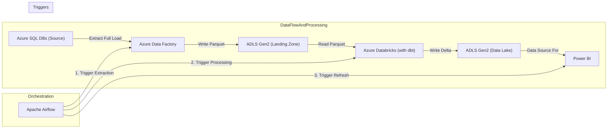

# RFC: Standard Batch Ingestion Strategy from Azure SQL (Revised)

## 📜 Table of contents
---
```table-of-contents```

## 🤓 TL;DR;
---
This RFC proposes a standard batch ingestion strategy for extracting full loads from Azure SQL databases using Azure Data Factory (ADF), landing data in Azure Data Lake Storage (ADLS) Gen2 as Parquet, processing it with Azure Databricks and dbt into Delta Lake format within ADLS Gen2, and orchestrating the end-to-end flow, including a Power BI refresh trigger, using Apache Airflow.

## 🔭 Context and Scope
---
**Background:**
Our team needs to establish a repeatable and broadly applicable batch ingestion strategy to handle data from straightforward sources, initially focusing on relational databases like Azure SQL. The goal is to leverage Azure Data Factory's capabilities for sources that fit its paradigm well. This initial strategy focuses on simplicity and full data loads, deferring more complex patterns like incremental loading and schema evolution handling to future discussions and subsequent RFCs.

**Problem Definition:**
The primary challenge is ingesting data from numerous Azure SQL databases within the client's environment. The required process involves several distinct steps:
1.  Extracting data from various Azure SQL tables using Azure Data Factory (ADF).
2.  Storing this raw extracted data reliably in a designated landing zone within Azure Data Lake Storage (ADLS) Gen2.
3.  Processing and transforming the raw data using Azure Databricks, leveraging Data Build Tool (dbt) for transformation logic.
4.  Storing the processed, analysis-ready data in a structured data lake, also within ADLS Gen2.
5.  Triggering a refresh of downstream Power BI reports once the data processing is complete.
The entire workflow must be orchestrated using our existing Astronomer Airflow platform.

**Scope:**
*   **In Scope:**
    *   Batch ingestion of **full loads** from **Azure SQL databases**.
    *   Using **Azure Data Factory (ADF)** for extraction.
    *   Using **Azure Data Lake Storage (ADLS) Gen2** for both landing (raw) and data lake (processed) storage.
    *   Storing landing data in **Parquet** format with a specific logical path convention (`/data_source/database/schema/logical_date_table/*.parquet`), strictly enforced and documented.
    *   Using **Azure Databricks** integrated with **dbt** for data processing and transformation.
    *   Storing processed data lake data in **Delta Lake** format.
    *   Using **Apache Airflow** (Astronomer) for end-to-end orchestration.
    *   Triggering **Power BI** dataset refreshes via Airflow.
    *   Implementing a simple, repeatable pattern suitable for multiple tables/databases.
    *   Utilizing ADLS Gen2 lifecycle management for data archiving in the landing zone, aligned with compliance requirements.
*   **Out of Scope:**
    *   Incremental data loading strategies (CDC, watermarking, etc.).
    *   Handling schema evolution in source systems automatically.
    *   Ingestion from complex or non-relational data sources.
    *   Real-time or streaming ingestion patterns.
    *   Detailed implementation of specific dbt models or complex transformations (focus is on the infrastructure and flow).

## 🎯 Goals (and Non-Goals)
---
*   **Goals:**
    *   Successfully extract data from specified Azure SQL database tables using ADF.
    *   Store extracted raw data in an ADLS Gen2 landing zone in Parquet format.
    *   Ensure landing zone data adheres to the path convention: `/data_source/database/schema/logical_date_table/*.parquet`.
    *   Process and transform the landed data using Azure Databricks and dbt.
    *   Store the processed data in an ADLS Gen2 data lake zone in Delta Lake format.
    *   Orchestrate the entire ingestion and processing flow (ADF -> Databricks -> Power BI) using Apache Airflow with robust error handling and retries.
    *   Trigger Power BI dataset refreshes upon successful data processing.
    *   Prioritize a simple, repeatable, and maintainable solution leveraging standard Azure and Airflow capabilities.
    *   Define and implement a strategy for archiving raw data in the landing zone using ADLS lifecycle policies, ensuring compliance with data retention requirements.
*   **Non-Goals:**
    *   Implement incremental data loading mechanisms.
    *   Provide a solution for automatic schema evolution detection and handling.
    *   Support data sources other than Azure SQL in this specific RFC.

## 🦉 The Actual Design
---
The proposed design utilizes a combination of Azure services orchestrated by Apache Airflow to achieve the batch ingestion goals.

**Architecture Overview:**

1.  **Orchestration (Airflow):** An Apache Airflow DAG defines and manages the sequence of tasks, including robust error handling and retry logic at the task level. Airflow resource requirements (workers, CPU, memory) must be considered for concurrent DAG runs.
2.  **Extraction (ADF):** Airflow triggers an Azure Data Factory (ADF) pipeline using secure authentication (Managed Identity preferred). This pipeline dynamically extracts full table data from source Azure SQL databases. Monitoring of ADF pipeline runs (duration, rows copied, errors) is essential.
3.  **Landing Zone (ADLS Gen2):** The ADF pipeline writes the extracted data as Parquet files into a designated 'landing' container/path within ADLS Gen2, adhering to the specified path convention. Access control (IAM roles, ACLs) must be defined and enforced.
4.  **Processing (Databricks/dbt):** Airflow triggers an Azure Databricks job (executing a notebook or script) using secure authentication. This job reads the raw Parquet files for a given table/logical date from the landing zone (using Managed Identity or secure secrets for ADLS access), applies transformations defined and managed by dbt (with version control and deployment strategy), and prepares the data for the data lake. Databricks cluster sizing (instance types, autoscaling) must be optimized for workload and cost, with DBU consumption monitored.
5.  **Data Lake (ADLS Gen2):** The Databricks job writes the transformed data into a 'data-lake' container/path within ADLS Gen2 in Delta Lake format, ensuring idempotency (e.g., using `overwrite` mode for full loads). Access control must be defined for consumers. Delta Lake table maintenance (OPTIMIZE, VACUUM) needs to be planned and potentially automated.
6.  **Reporting Trigger (Airflow/Power BI):** Upon successful completion of the Databricks job, Airflow triggers a refresh of the relevant Power BI dataset(s) using secure authentication. Monitoring and retry mechanisms for refresh failures are required.
7.  **Archiving (ADLS Gen2):** An ADLS Gen2 lifecycle management policy is configured on the landing zone storage to automatically transition older raw Parquet files to cooler storage tiers (Cool, Archive) and eventually delete them based on defined age rules aligned with compliance and recovery needs.

**Data Flow & Component Details:**

*   **Airflow DAG:**
    *   Uses `AzureDataFactoryRunPipelineOperator` to start the ADF extraction pipeline, passing necessary parameters securely (e.g., logical date, table details via Key Vault backed Connections/Variables).
    *   Uses `DatabricksRunNowOperator` or `DatabricksSubmitRunOperator` to execute the Databricks processing job, passing parameters securely.
    *   Uses `PowerBIDatasetRefreshOperator` to initiate the Power BI refresh.
    *   Defines dependencies (ADF -> Databricks -> Power BI) and configures task-level retries and failure notifications.
*   **ADF Pipeline:**
    *   Uses a `Lookup` activity to query Azure SQL metadata (e.g., `INFORMATION_SCHEMA.TABLES`) efficiently to get the list of tables to ingest.
    *   Uses a `ForEach` activity to iterate over the table list, with appropriate parallelism settings and error handling (e.g., logging failures, option to continue on single table failure).
    *   Inside the `ForEach`, a `Copy Activity` performs the extraction:
        *   **Source:** Parameterized Azure SQL dataset, dynamically set to the current table. Authentication via Managed Identity is preferred.
        *   **Sink:** Parameterized ADLS Gen2 dataset (Parquet format). Parameters (`data_source`, `database`, `schema`, `logical_date`, `table`) construct the dynamic output path. Data type mappings need consideration.
*   **ADLS Gen2:**
    *   Separate containers or root paths for `landing` (Parquet) and `data-lake` (Delta) with distinct access controls.
    *   Lifecycle management policy applied to the `landing` area, documented and reviewed against retention requirements.
*   **Databricks Job:**
    *   Reads Parquet data from the specified landing path using Spark (e.g., `spark.read.load(...)`).
    *   Leverages dbt (via `dbt-databricks` adapter) with a defined project structure, version control (e.g., Git), and deployment process. dbt logs and run results should be captured.
    *   Writes the final transformed data to the data lake path in Delta format (e.g., `dataframe.write.format("delta").mode("overwrite").save(...)` or `saveAsTable` if using Hive Metastore) ensuring idempotency for full loads.
    *   Includes Delta table maintenance steps (OPTIMIZE, VACUUM) or schedules them separately.

**Architecture Diagram:**


<!-- Diagram accurately reflects the high-level architecture and flow. -->

This design adheres to the simplicity requirement by using standard patterns and native integrations between the services. Key areas for detailed design include security configuration, error handling, monitoring, and performance tuning.

## 🌈 Alternatives considered
---
The research focused primarily on validating the suitability of the proposed technology stack (ADF, ADLS Gen2, Databricks/dbt, Airflow) for the defined requirements. As this stack represents a standard and robust approach for batch processing on Azure, extensive comparison with fundamentally different architectures (e.g., using Azure Synapse Pipelines, Azure Functions for simpler tasks) was not the core focus for this initial, simple batch ingestion pattern, though these could be considered for future, different use cases. The main "option" evaluated was the specific implementation pattern described below.

|          | Option 1 (ADF -> ADLS (Parquet) -> Databricks/dbt -> ADLS (Delta) -> Airflow -> Power BI) | Option 2 (N/A) | Option 3 (N/A) |
| -------- | --------------------------------------------------------------------------------------- | -------------- | -------------- |
| Overview | Full batch loads from Azure SQL via ADF, landing as Parquet in ADLS, processing via Databricks/dbt to Delta in ADLS, orchestrated by Airflow with Power BI refresh. | -              | -              |
| Links    | [Source 1], [Source 2], [Source 3], [Source 4], [Source 5], [Source 6], [Source 7], [Source 8], [Source 9] | -              | -              |
| Pros     | - Leverages native Azure services integration.<br/>- ADF visual interface simplifies standard ingestion.<br/>- Repeatable ADF pattern (Lookup+ForEach+Copy).<br/>- Databricks optimized for Delta Lake.<br/>- dbt provides transformation structure.<br/>- Airflow offers robust orchestration.<br/>- Meets all specified requirements.<br/>- Aligns with simplicity goal using standard patterns. | -              | -              |
| Cons     | - Requires managing multiple Azure services.<br/>- Costs scale with usage (ADF, Databricks).<br/>- Requires careful initial setup/configuration and operational overhead. | -              | -              |
| Other    | Utilizes ADLS Gen2 lifecycle management for archiving.                                  | -              | -              |

**Comparison Summary & Rationale:**
The research confirmed that Option 1 is a highly suitable and recommended approach. It directly addresses all technical requirements using a standard, well-documented pattern within the Azure ecosystem and leveraging native integrations facilitated by Airflow operators. While other tools or custom code *could* be used, this combination represents a balanced, maintainable, and scalable solution for the defined scope, making it the preferred choice. The approach also directly addresses the archiving requirement via ADLS lifecycle policies.

## 💥 Impact
---
*   **Cost:** Introduction of costs associated with ADF (pipeline runs, data movement), ADLS Gen2 (storage, transactions, lifecycle operations), Azure Databricks (cluster uptime, DBUs), and potentially increased Airflow worker resource usage. Costs will scale with data volume, frequency of runs, and complexity of transformations.
    *   **Mitigation/Action:** Implement detailed cost monitoring and attribution (e.g., Azure tags). Optimize Databricks cluster configurations (auto-scaling, spot instances where applicable). ADLS lifecycle policies will help mitigate long-term storage costs for raw data. Develop a cost model during PoC.
*   **Source System Load:** ADF Copy Activities performing full table scans can significantly impact source Azure SQL database performance, especially during concurrent extractions.
    *   **Mitigation/Action:** Coordinate closely with source system owners to define acceptable load limits and extraction windows. Monitor source system performance during runs. Consider strategies like reading from read-replicas if available or implementing resource governance on the source.
*   **Infrastructure:** Requires configuration and maintenance of Azure resources (ADF, ADLS, Databricks) and their integration points (Linked Services, network connectivity, permissions). Requires management of Airflow connections and operators.
    *   **Mitigation/Action:** Utilize Infrastructure as Code (IaC) (e.g., Terraform, Bicep) for repeatable deployment and management. Define standard operating procedures (SOPs) and runbooks.
*   **Team Skills:** Requires team proficiency in ADF development, Databricks (Spark, potentially Scala/Python), dbt (SQL), ADLS Gen2 configuration (including security and lifecycle), and Airflow DAG development/maintenance.
    *   **Mitigation/Action:** Assess skill gaps and plan for training or upskilling. Document best practices and patterns.
*   **Dependencies:** Creates dependencies on the availability and performance of multiple Azure services (ADF, ADLS, Databricks, Azure AD/Entra ID, Key Vault) and the Airflow platform.
    *   **Mitigation/Action:** Implement robust monitoring of dependencies. Define SLAs and contingency plans for service outages.
*   **Monitoring & Alerting:** Requires comprehensive monitoring across the entire pipeline (Airflow, ADF, Databricks, ADLS, Power BI refresh) to ensure health, performance, and data quality.
    *   **Mitigation/Action:** Define key metrics (run duration, data volume, success/failure rates, DBU usage, data quality checks). Integrate logs and metrics into a central system (e.g., Azure Monitor/Log Analytics). Implement actionable alerts with defined thresholds and response procedures. Consider implementing data quality tests within the dbt layer.
*   **Security:** Requires careful management of credentials, permissions, and network access across all components. Handling of potentially sensitive data needs consideration.
    *   **Mitigation/Action:** Implement least privilege access controls using Managed Identities wherever possible. Securely manage remaining secrets using Azure Key Vault integrated with Airflow, ADF, and Databricks. Define and implement network security controls (e.g., Private Endpoints, VNet integration) as required. Ensure data encryption at rest and in transit. If handling sensitive data, implement appropriate masking or anonymization techniques and ensure audit logging is configured. Conduct a thorough security review post-implementation.

## 💬 Discussion
---
*   **Archiving & Retention:** What are the specific data retention periods required for the raw landing zone data based on compliance, recovery, and business needs? How frequently should the ADLS lifecycle policy be reviewed?
*   **Error Handling & Recovery:** What is the detailed strategy for handling failures at each stage (ADF Lookup/Copy, Databricks job execution, dbt model failure, Power BI refresh)? How will partial failures (e.g., one table failing in ADF ForEach) be handled and reported? What is the process for investigating failures, correcting data issues, and triggering reruns? How will data quality issues detected during processing be managed (e.g., quarantine, alert, fail)?
*   **Monitoring & Alerting Details:** What specific metrics (beyond basic success/failure) are critical for operational insight (e.g., data volume changes, row count validation, duration thresholds)? What are the target response times for different alert severities? Who is responsible for responding to alerts?
*   **Parameterization & Secrets Management:** What is the definitive strategy for managing environment-specific configurations (dev/test/prod) and secrets? Confirm the use of Azure Key Vault and Managed Identities as the standard. How will Key Vault access be managed?
*   **Scalability & Performance:** What are the anticipated data volumes and number of tables? What performance testing is planned? What are the initial configurations for ADF parallelism (ForEach, Copy DIUs) and Databricks cluster sizing/auto-scaling? How will bottlenecks be identified and addressed?
*   **Idempotency:** Confirm the implementation details for ensuring idempotency, particularly the use of `overwrite` mode for Delta Lake writes corresponding to the logical date for full loads.
*   **Delta Lake Maintenance:** What is the plan for running `OPTIMIZE` and `VACUUM` on the Delta tables in the data lake? Will this be part of the main ingestion DAG or a separate maintenance process? What retention period will be used for `VACUUM`?
*   **dbt Integration:** How will the dbt project be structured, version controlled (e.g., Git repository), and deployed for use by Databricks jobs? How will dbt run results and logs be monitored?
*   **Infrastructure as Code (IaC):** What is the plan for implementing IaC for the Azure resources? Which tool (Terraform, Bicep) will be used?
*   **Network Security:** What are the specific network security requirements? Will VNet integration and Private Endpoints be necessary for ADF, Databricks, ADLS, and Azure SQL access?
*   **Compliance & Data Sensitivity:** Is sensitive data (PII, etc.) in scope? If so, what specific measures (masking, encryption, access logging) are required, and how will compliance be audited?

## 🤝 Final decision
---
The final decision is to adopt the proposed batch ingestion strategy: **Azure Data Factory -> ADLS Gen2 (Landing/Parquet) -> Databricks/dbt -> ADLS Gen2 (Data Lake/Delta) -> Power BI Refresh, orchestrated by Apache Airflow (Option 1)**.

This approach is chosen because it directly meets all stated requirements using a standard, well-integrated stack of Azure services and open-source tools (Airflow, dbt). It prioritizes simplicity and repeatability for the defined scope of full batch loads from Azure SQL, leveraging established patterns within ADF and Databricks. It also provides a clear solution for data archiving using ADLS Gen2 lifecycle management. The identified risks and operational considerations will be addressed through detailed design and implementation follow-ups.

## ☝️ Follow-ups
---
*   Develop detailed design for the generic ADF pipeline (Lookup/ForEach/Copy pattern with parameterization, performance tuning, error handling).
*   Develop detailed design for the Databricks job (notebooks/scripts, Spark configuration, Delta write strategy, idempotency implementation).
*   Develop detailed design for the initial dbt project structure, version control, deployment strategy, and integration with Databricks jobs.
*   Develop the standard Airflow DAG structure (operators, parameter passing, error handling, retries, notifications).
*   Define and implement the specific ADLS Gen2 lifecycle management policy rules based on documented retention requirements.
*   Define and implement the strategy for secure parameterization and secrets management using Azure Key Vault and Managed Identities.
*   Define and implement the detailed monitoring and alerting strategy (metrics, thresholds, tools, dashboards, response procedures).
*   Define and implement the detailed error handling and recovery strategy, including data quality checks and procedures.
*   Develop Infrastructure as Code (IaC) scripts (Terraform/Bicep) for deploying Azure resources.
*   Define and implement required network security controls (e.g., Private Endpoints, VNet integration).
*   Define and implement Delta Lake maintenance procedures (`OPTIMIZE`, `VACUUM`).
*   Perform initial Proof of Concept (PoC) implementation with a representative set of tables.
*   Plan and execute performance and load testing based on anticipated volumes.
*   Document operational procedures, runbooks, and troubleshooting guides.
*   Conduct a detailed security review of the implemented solution.
*   Document compliance considerations and how the solution meets requirements.
*   Plan and conduct team training sessions on operating and troubleshooting the pipeline.

## 🔗 Related
---
*   [Source 1: Copy activity - Azure Data Factory & Azure Synapse | Microsoft Learn](https://learn.microsoft.com/en-us/azure/data-factory/copy-activity-overview)
*   [Source 2: Copy data in bulk using Azure portal - Azure Data Factory | Microsoft Learn](https://learn.microsoft.com/en-us/azure/data-factory/tutorial-bulk-copy-portal)
*   [Source 3: Use dataset parameters to copy data to dynamically defined source ... with ADF](https://medium.com/azure-tutorials/use-dataset-parameters-to-copy-data-to-dynamically-defined-source-and-sink-directories-with-adf-3ec632d548df)
*   [Source 4: Azure Data factory Dynamically create folder to export files](https://learn.microsoft.com/en-us/answers/questions/935032/azure-data-factory-dynamically-create-folder-to-ex)
*   [Source 5: Migrate a Parquet data lake to Delta Lake - Azure Databricks | Microsoft Learn](https://learn.microsoft.com/en-us/azure/databricks/migration/parquet-to-delta-lake)
*   [Source 6: Read Parquet files using Databricks](https://docs.databricks.com/en/query/formats/parquet.html) (Corrected Azure link)
*   [Source 7: Azure Data Factory Operators - Apache Airflow](https://airflow.apache.org/docs/apache-airflow-providers-microsoft-azure/stable/operators/adf_run_pipeline.html)
*   [Source 8: Orchestrate Azure Databricks jobs with Apache Airflow | Microsoft Learn](https://learn.microsoft.com/en-us/azure/databricks/jobs/how-to/use-airflow-with-jobs)
*   [Source 9: Microsoft Power BI Operators - Apache Airflow](https://airflow.apache.org/docs/apache-airflow-providers-microsoft-powerbi/stable/index.html) (Corrected Provider link)
*   [Source 10: Configure a lifecycle management policy - Azure Blob Storage | Microsoft Learn](https://learn.microsoft.com/en-us/azure/storage/blobs/lifecycle-management-policy-configure)
*   [Source 11: Optimize costs by automatically managing the data lifecycle | Microsoft Learn](https://learn.microsoft.com/en-us/azure/storage/blobs/lifecycle-management-overview)
*   [Azure Key Vault documentation | Microsoft Learn](https://learn.microsoft.com/en-us/azure/key-vault/)
*   [Managed identities for Azure resources | Microsoft Learn](https://learn.microsoft.com/en-us/entra/identity/managed-identities-azure-resources/overview)
*   [What is Delta Lake? - Azure Databricks | Microsoft Learn](https://learn.microsoft.com/en-us/azure/databricks/delta/)
