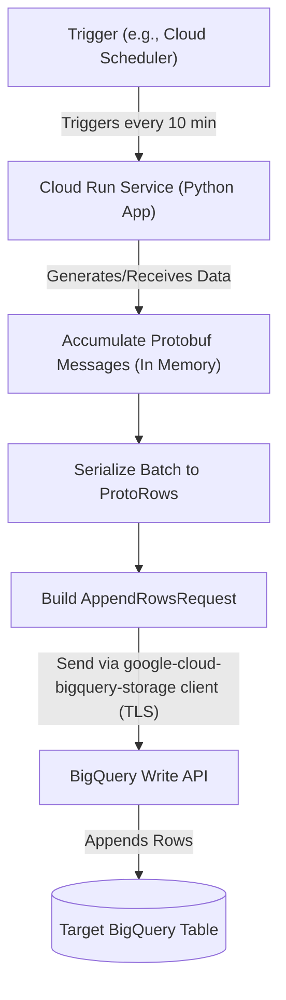

# RFC: BigQuery Ingestion via Write API and Protobuf on Cloud Run

## 📜 Table of contents
<!-- Use markdown-toc or similar to generate this -->
```table-of-contents
- [📜 Table of contents](#-table-of-contents)
- [🤓 TL;DR;](#-tldr)
- [🔭 Context and Scope](#-context-and-scope)
- [🎯 Goals (and Non-Goals)](#-goals-and-non-goals)
- [🦉 The Actual Design](#-the-actual-design)
  - [Architecture & Components](#architecture--components)
  - [Data Flow](#data-flow)
  - [Diagram](#diagram)
  - [Key Technical Mechanisms](#key-technical-mechanisms)
- [🌈 Alternatives considered](#-alternatives-considered)
- [💥 Impact](#-impact)
- [💬 Discussion](#-discussion)
- [🤝 Final decision](#-final-decision)
- [☝️ Follow-ups](#-follow-ups)
- [🔗 Related](#-related)
- [Reviewer Feedback Summary](#reviewer-feedback-summary)
```

## 🤓 TL;DR;
---
This RFC proposes using the Google BigQuery Write API via its Python client library (`google-cloud-bigquery-storage`) within a Google Cloud Run service to ingest data batches every 10 minutes. Data schema will be defined and enforced using Protocol Buffers (Protobuf), ensuring type safety and meeting low-latency ingestion requirements without introducing Google Cloud Pub/Sub for this specific workflow.

## 🔭 Context and Scope
---
Our team requires a reliable method to ingest data generated by a Python application into BigQuery. This application runs periodically on Google Cloud Run, specifically every 10 minutes, and produces data in batches. A key requirement is the use of Protocol Buffers (Protobuf) to define the data structure, ensuring schema consistency across the system. The current infrastructure is based on Google Cloud Platform.

The **problem** is to establish an efficient, simple, and reliable ingestion pipeline from the Cloud Run Python application to BigQuery that adheres to the 10-minute batch frequency, utilizes Protobuf for schemas, guarantees atomic row-level writes within each API call, and operates purely within Python without introducing external messaging systems like Pub/Sub for this specific flow.

The **scope** of this RFC is limited to the design and implementation of the data ingestion mechanism from the point where the Python application has a batch of data ready (as Protobuf objects) to the point where that data is successfully appended to the target BigQuery table. This includes the choice of API, client library usage, Protobuf integration, deployment considerations on Cloud Run, and the initial error handling strategy.

It does *not* cover:
*   The data generation logic within the Python application itself.
*   Detailed monitoring, alerting, and logging implementation beyond acknowledging the need.
*   Complex schema evolution strategies beyond ensuring initial compatibility.
*   Detailed operational procedures like runbooks or rollback strategies.

These excluded items are critical for production readiness and must be addressed in follow-up tasks or subsequent design documents.

## 🎯 Goals (and Non-Goals)
---
*   **Goal 1:** Ingest data batches from a Python application into BigQuery every 10 minutes.
*   **Goal 2:** Utilize Protocol Buffers (Protobuf) for data schema definition and transmission.
*   **Goal 3:** Ensure data is written atomically at the row level within each successful `AppendRows` API call.
*   **Goal 4:** Implement the solution using pure Python running on Google Cloud Run.
*   **Goal 5:** Prefer the simplest technical solution that meets all other goals and constraints.

*   **Non-Goal 1:** Utilize Google Cloud Pub/Sub as an intermediary for this ingestion path.
*   **Non-Goal 2:** Implement a solution requiring significant infrastructure beyond Cloud Run and BigQuery (e.g., Dataflow, separate GCE instances).
*   **Non-Goal 3:** Define complex schema evolution strategies within this RFC (this requires a dedicated follow-up).
*   **Non-Goal 4:** Implement data generation logic; the focus is solely on ingestion.
*   **Non-Goal 5:** Define detailed operational procedures (monitoring dashboards, alerting policies, runbooks, IaC implementation details) within this RFC (these are required follow-ups).

## 🦉 The Actual Design
---
The proposed design utilizes the **Google BigQuery Write API** accessed via the `google-cloud-bigquery-storage` Python client library. The solution will be deployed as a Python application running on **Google Cloud Run**.

### Architecture & Components

1.  **Cloud Run Service:** A containerized Python application deployed on Cloud Run.
    *   **Triggering:** The service needs a trigger mechanism to run every 10 minutes (e.g., Cloud Scheduler invoking the service endpoint). The exact mechanism needs confirmation.
    *   **Resources:** Appropriate CPU, memory limits, and concurrency settings must be defined based on expected batch sizes and processing requirements.
2.  **Protobuf Schema:** Data structure defined in a `.proto` file. This file is compiled into Python code (`_pb2.py`) using the `protoc` compiler and included in the application container.
    *   **Management:** A process for versioning the `.proto` file and managing the compiled code alongside application code is required.
3.  **Python Application Logic:**
    *   **Initialization:** Initializes the `BigQueryWriteClient`. Consider the impact of initialization time if Cloud Run instances are short-lived (triggered per run).
    *   **Batching:** Accumulates generated/received Protobuf message objects into an in-memory list or buffer during the 10-minute cycle. The maximum batch size (number of messages, total data volume) must be carefully managed to stay within Cloud Run memory limits.
    *   **Serialization & Sending:** Constructs an `AppendRowsRequest` with the accumulated messages serialized into the `ProtoRows` field. Calls the `client.append_rows()` method, sending the batch to the BigQuery Write API's default stream for the target table.
    *   **Error Handling:** Implements error handling around the `append_rows` call. This must include:
        *   Retries for transient gRPC errors (using appropriate backoff).
        *   Checking the response for potential row-level errors (e.g., schema mismatch, invalid data).
        *   A defined strategy for handling persistent errors and row-level errors (e.g., logging details, dead-lettering failed rows/batches). Basic logging is insufficient for production.
    *   **Logging:** Implement structured logging (e.g., JSON format to stdout/stderr for Cloud Logging) including relevant context (batch ID, record counts, error details) for effective troubleshooting.
4.  **BigQuery Table:** A standard BigQuery table whose schema must be compatible with the Protobuf message descriptor used in the application.
    *   **Provisioning:** The table should be provisioned and managed using Infrastructure as Code (IaC).
    *   **Schema Compatibility:** The deployment process must include checks or strategies to ensure compatibility between the deployed Protobuf schema and the target BigQuery table schema.
    *   **Optimization:** Consider partitioning and clustering for cost and performance optimization based on query patterns. Define data retention policies if applicable.
5.  **IAM:** The Cloud Run service's service account requires permissions to write data to the target BigQuery table and retrieve its metadata.
    *   **Least Privilege:** Grant the most specific roles needed, such as `roles/bigquery.dataEditor` or preferably more fine-grained permissions like `bigquery.tables.updateData` (or `bigquery.tables.insertData` if only appending) and `bigquery.tables.get`. Avoid overly broad roles. The service account identity should be used directly (no key management needed).

### Data Flow

```
[Trigger (e.g., Cloud Scheduler)] --(every 10 min)--> [Cloud Run Service (Python App)] --> [Accumulate Protobuf Messages (In Memory)] --> [Serialize Batch to ProtoRows] --> [Build AppendRowsRequest] --(Send via google-cloud-bigquery-storage client over TLS)--> [BigQuery Write API] --> [Target BigQuery Table]
```

### Diagram



### Key Technical Mechanisms

*   **Protobuf Integration:** The `google-cloud-bigquery-storage` client natively supports sending data as `ProtoRows`, handling serialization. The Write API performs schema validation against the BigQuery table schema upon ingestion.
*   **Batching:** Achieved by application-level buffering within the Cloud Run instance's memory. Requires careful sizing and monitoring to avoid exceeding memory limits.
*   **Atomicity:** The Write API ensures that within a successful `AppendRows` call, each row append is atomic. The API call itself might succeed even if some rows within the batch fail validation; these row-level errors must be handled by the application. Failures in the API call itself (e.g., network error before commit) prevent rows from that call being written.
*   **Deployment:** Standard Cloud Run deployment using a Docker container. Requires IaC (e.g., Terraform, Pulumi) for managing the Cloud Run service, BQ table, and IAM roles. A rollback strategy for deployments should be defined.

## 🌈 Alternatives considered
---

|          | Option 1 (BigQuery Write API) | Option 2 (BigQuery Load Jobs) | Option 3 (Legacy Streaming Inserts - `insertAll`) |
| -------- | ----------------------------- | ----------------------------- | ------------------------------------------------- |
| Overview | Use `google-cloud-bigquery-storage` client with `ProtoRows` on default stream. App batches messages. | Generate files (e.g., Avro) in GCS, trigger BQ Load Job via `google-cloud-bigquery` client. | Use `insertAll` method from `google-cloud-bigquery` client (JSON payload). |
| Links    | [Write API Docs](https://cloud.google.com/bigquery/docs/write-api) <br/> [Python Client](https://cloud.google.com/python/docs/reference/bigquerystorage/latest) | [Load Jobs Docs](https://cloud.google.com/bigquery/docs/loading-data) <br/> [Python Client](https://cloud.google.com/python/docs/reference/bigquery/latest) | [Legacy Streaming API](https://cloud.google.com/bigquery/docs/reference/standard-sql/data-manipulation-language#insert_statement) |
| Pros     | - Native Protobuf support <br/> - Low latency ingestion <br/> - Row-level atomicity (within call) <br/> - Official Python client <br/> - Good for app-level batching | - Cost-effective for very large, infrequent batches <br/> - Fully transactional jobs (all or nothing) | - Simpler API call structure for basic JSON inserts |
| Cons     | - Requires Protobuf definition/compilation <br/> - Requires robust handling of stream/row-level errors <br/> - Pricing based on ingested volume <br/> - In-memory batching needs careful memory management | - Higher latency (job startup) <br/> - **No direct Protobuf input support** <br/> - More complex workflow (App->GCS->BQ Job) <br/> - Requires GCS permissions/costs | - **Deprecated** <br/> - Lower throughput limits <br/> - **No Protobuf support** (requires JSON) <br/> - Eventual consistency <br/> - Less efficient |
| Other    | Recommended for streaming/micro-batching. Uses gRPC. | Best for traditional, large batch ETL. | Generally discouraged; replaced by Write API. |

**Comparison Summary & Rationale:**

The **BigQuery Write API (Option 1)** is the strongly recommended approach as it uniquely satisfies all primary requirements. It offers native support for Protobuf (`ProtoRows`), enabling direct ingestion of Protobuf messages generated by the Python application, fulfilling a core constraint. Its low-latency nature is well-suited for the 10-minute batch frequency, providing quicker feedback than Load Jobs. The Write API guarantees row-level atomicity for appends within a successful request. The official Python client library (`google-cloud-bigquery-storage`) provides a direct and relatively simple integration path within the Cloud Run environment.

**BigQuery Load Jobs (Option 2)** were considered but rejected primarily because they do not directly support Protobuf as an input format. This would necessitate an intermediate conversion step (e.g., to Avro or Parquet), adding complexity and violating the direct Protobuf usage requirement. While cost-effective for massive batches, the added latency and workflow complexity (staging files in GCS) are less ideal for the 10-minute interval compared to the Write API.

**Legacy Streaming Inserts (`insertAll`) (Option 3)** were dismissed because the API is deprecated, has lower performance and throughput limits, offers only eventual consistency, and crucially, lacks native Protobuf support, requiring conversion to JSON. It fails to meet multiple requirements and is not recommended for new implementations.

Therefore, the BigQuery Write API provides the most direct, efficient, and requirement-compliant solution for ingesting Protobuf data batches from Cloud Run every 10 minutes, provided the operational considerations (error handling, schema management, monitoring) are adequately addressed.

## 💥 Impact
---
*   **Cost:**
    *   Introduces costs associated with BigQuery Write API usage (priced per GiB ingested, check current pricing).
    *   Introduces Cloud Run costs (depend on execution time, memory/CPU allocation, request volume).
    *   Introduces BigQuery storage costs.
    *   Requires a detailed cost estimate based on expected data volumes and resource usage.
    *   Requires implementation of cost tracking using GCP labels.
*   **Performance:**
    *   Provides low-latency ingestion compared to batch load jobs, suitable for the 10-minute interval.
    *   Data availability in BigQuery will be near real-time after each successful batch submission.
    *   Requires definition and monitoring of Service Level Objectives (SLOs) for data freshness and pipeline success rate.
*   **Operations/Maintenance:**
    *   Requires managing the Cloud Run service deployment (IaC, rollback strategy).
    *   Requires robust monitoring and alerting for the service execution and ingestion process.
    *   Requires comprehensive error handling and potentially a dead-letter mechanism.
    *   Requires a defined process for managing Protobuf schema definitions and ensuring consistency with the BigQuery table schema.
    *   Impacts the on-call rotation; requires runbooks and troubleshooting guides.
*   **Development:**
    *   Requires familiarity with the `google-cloud-bigquery-storage` client library, Protobuf definition and compilation (`protoc`), and Cloud Run deployment.
    *   Initial setup involves defining the `.proto` file, ensuring BQ table compatibility, and implementing the core logic and error handling.
*   **Readiness:**
    *   Requires team training if unfamiliar with the specific technologies.
    *   Requires development of IaC scripts, monitoring dashboards, alerting policies, and operational documentation (runbooks).
    *   Requires thorough operational testing (load testing, failure injection).
*   **Existing Systems:** Minimal impact expected on existing systems, as this is a new ingestion path directly into BigQuery.
*   **Security:**
    *   Requires careful management of IAM permissions for the Cloud Run service account, adhering to the principle of least privilege (refine roles beyond `dataEditor`).
    *   Requires assessment of data sensitivity. If PII or other sensitive data is ingested, ensure appropriate handling (e.g., masking, tokenization) and compliance with relevant regulations (e.g., GDPR, CCPA). Document compliance measures.
    *   Network security for Cloud Run (e.g., ingress controls, VPC-SC if applicable) should be configured appropriately.
    *   Data is encrypted in transit (TLS via gRPC) and at rest (BQ default encryption).

## 💬 Discussion
---
This section captures key questions and areas requiring further clarification or decision-making by the team before or during implementation.

*   **Cloud Run Triggering:** Confirm the specific mechanism for triggering the Cloud Run service every 10 minutes (e.g., Cloud Scheduler).
*   **Optimal Batch Size & Memory Management:** How will the optimal batch size be determined to balance efficiency, cost, and Cloud Run memory limits? What is the strategy if a single 10-minute window generates more data than can be safely buffered in memory?
*   **Error Handling Strategy (Persistent Errors):** What is the definitive strategy for handling persistent errors (e.g., schema mismatch detected by Write API, invalid data causing row-level errors)? Will failed rows/batches be sent to a dead-letter queue (e.g., a separate BQ table, Pub/Sub topic)? What is the process for investigating and reprocessing dead-lettered data?
*   **Schema Evolution Process:** What is the detailed process for managing updates to the Protobuf schema and synchronizing them with the BigQuery table schema? How will backward/forward compatibility be handled? How will changes be tested and deployed safely?
*   **Monitoring & Alerting Details:** What specific metrics (e.g., rows ingested/failed, latency, memory usage, error types), dashboards (Cloud Monitoring), and alerting policies (thresholds, notification channels) will be implemented?
*   **Idempotency vs. At-Least-Once:** Is the potential for duplicate records (if the Cloud Run job retries successfully after a partial failure or timeout) acceptable? Or is stricter exactly-once delivery required, necessitating the use of Write API stream offsets (which adds complexity)?
*   **Compliance & Sensitive Data:** Does the data being ingested contain PII or fall under specific compliance regulations? If so, what are the requirements, and how will they be addressed in the pipeline (e.g., pre-ingestion processing, specific BQ policies)?
*   **IaC & Rollback:** Confirm commitment to using IaC for all components. What is the specific rollback strategy for Cloud Run deployments?
*   **Operational Readiness:** How will runbooks be developed and maintained? How will operational testing (load, failure injection) be conducted?

## 🤝 Final decision
---
The final decision is to adopt **Option 1: Use the BigQuery Write API (Default Stream) with Protobuf messages (`ProtoRows`)** via the `google-cloud-bigquery-storage` Python client library, running within a Google Cloud Run service.

This approach directly meets all specified requirements and constraints. However, its successful implementation and operation are contingent upon thoroughly addressing the points raised in the Discussion section and completing the operational readiness tasks outlined in the Follow-ups.

## ☝️ Follow-ups
---
This list includes both development and essential operational readiness tasks required before production deployment.

*   **Task 1 (Dev):** Define the initial `.proto` schema file for the data records.
*   **Task 2 (Dev):** Compile the `.proto` file to `_pb2.py` using `protoc` and establish version control for schema files.
*   **Task 3 (Dev):** Develop the core Python application logic for Cloud Run (trigger handling, message creation, batch accumulation, `append_rows` call).
*   **Task 4 (Ops/Dev):** Define and implement comprehensive error handling and retry logic (transient errors, persistent errors, row-level errors, dead-lettering strategy).
*   **Task 5 (Ops/Dev):** Define and implement comprehensive structured logging.
*   **Task 6 (Ops/Readiness):** Define and implement detailed monitoring and alerting (metrics, dashboards, alerts).
*   **Task 7 (Ops/Readiness):** Define the process for managing Protobuf and BigQuery schema evolution.
*   **Task 8 (Ops/Readiness):** Develop Infrastructure as Code (IaC) scripts (e.g., Terraform) for provisioning the Cloud Run service, BigQuery table (including partitioning/clustering), IAM roles, and any triggering mechanism (e.g., Cloud Scheduler).
*   **Task 9 (Ops/Readiness):** Refine IAM permissions for the Cloud Run service account based on the principle of least privilege.
*   **Task 10 (Ops/Readiness):** Define and implement cost tracking using GCP labels. Create detailed cost estimates.
*   **Task 11 (Ops/Readiness):** Plan and execute operational testing (load testing, failure injection testing). Determine and document optimal batch size based on testing.
*   **Task 12 (Ops/Readiness):** Develop runbooks and troubleshooting guides.
*   **Task 13 (Ops/Readiness):** Define SLOs for the pipeline.
*   **Task 14 (Ops/Readiness):** Define Cloud Run deployment and rollback strategy.
*   **Task 15 (Compliance/Security):** If applicable, document how compliance requirements and sensitive data handling are addressed.
*   **Task 16 (Readiness):** Plan and conduct any necessary team training.
*   **Task 17 (Dev/Deployment):** Configure and deploy the application as a Cloud Run service using IaC.

## 🔗 Related
---
*   [BigQuery Write API Documentation](https://cloud.google.com/bigquery/docs/write-api)
*   [Python Client Library for BigQuery Storage Write API](https://cloud.google.com/python/docs/reference/bigquerystorage/latest)
*   [Using Protocol Buffers with Write API](https://cloud.google.com/bigquery/docs/write-api#protocol_buffer_support)
*   [Google Cloud Run Documentation](https://cloud.google.com/run/docs)
*   [Protocol Buffers Documentation](https://protobuf.dev/)
*   [Google Cloud Monitoring](https://cloud.google.com/monitoring/docs)
*   [Google Cloud Logging](https://cloud.google.com/logging/docs)
*   [Cloud Scheduler Documentation](https://cloud.google.com/scheduler/docs)

## Reviewer Feedback Summary
---
This RFC incorporates feedback from technical peer review and operational/risk assessment. Key areas highlighted and addressed (or added to Discussion/Follow-ups) include:

*   **Technical Details:** Clarification on Cloud Run triggering, client initialization impact, risks of in-memory batching, need for specifics on handling row-level Write API errors, idempotency considerations.
*   **Operational Readiness:** Emphasis on the critical need for defined strategies and implementation plans for monitoring, alerting, logging, error handling (especially persistent errors/DLQ), schema evolution management, IaC, runbooks, rollback procedures, and operational testing *before* production deployment.
*   **Security & Compliance:** Reinforcement of least privilege for IAM, need to assess and document handling of sensitive data and compliance requirements.
*   **Cost:** Requirement for detailed cost estimation and tracking mechanisms.
*   **Completeness:** Expansion of the Follow-ups section to explicitly include critical operational and readiness tasks.
*   **Diagram:** Mermaid diagram included to visualize the architecture.

The core design decision remains unchanged, but the RFC now better reflects the necessary considerations and follow-up work required for a robust and supportable production service.
