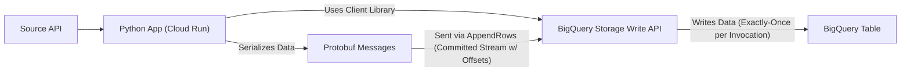

# RFC: BigQuery Ingestion via Storage Write API (Python/Protobuf) (Revised)

## 📜 Table of contents
---
```table-of-contents```

## 🤓 TL;DR;
---
This RFC proposes using the BigQuery Storage Write API via its Python client library, leveraging Protobuf messages for schema definition and serialization, to ingest data from an API into BigQuery. The solution involves a Python application running on Google Cloud Run, triggered every 10 minutes (e.g., by Cloud Scheduler), utilizing the "Committed" stream type with client-managed offsets to achieve row-level exactly-once delivery semantics per invocation. This approach adheres to the constraint of not using Pub/Sub but introduces complexity in client-side logic, particularly around offset management, error handling, and Protobuf schema lifecycle management.

## 🔭 Context and Scope
---
The primary objective is to establish an efficient and reliable method for ingesting data fetched from an external API into our BigQuery Data Warehouse. This follows a prior decision 'Use of BigQuery storage write API streaming inserts' to adopt the BigQuery Storage Write API.

The specific context involves a Python application deployed on Google Cloud Run, scheduled to execute every ten minutes. Each execution retrieves data from the API and writes it to BigQuery. A key constraint is the prohibition of using Google Cloud Pub/Sub for this ingestion pathway, necessitating a direct, Python-based implementation using the BigQuery Storage Write API. The rationale for this constraint should be clearly documented internally (e.g., referencing specific security policies or architectural decisions). The legacy BigQuery streaming insert methods (`insertAll`) are considered outdated and are not suitable. We acknowledge that there is limited official documentation for using the BQ Write API with Python, increasing the importance of thorough internal testing and documentation.

The scope of this RFC is limited to defining the optimal strategy and technical design for using the BigQuery Storage Write API within this Python/Cloud Run environment. It specifically addresses the requirements for batching, Protobuf usage, and achieving row-level atomicity (exactly-once semantics per invocation) while adhering to the no-Pub/Sub constraint. It covers the selection of the appropriate Write API stream type and outlines the core implementation pattern.

**Out of Scope (but critical follow-ups):**
*   Specifics of the source API data retrieval logic (including handling potential reprocessing on scheduler retries).
*   Detailed, robust error handling and dead-lettering strategies beyond basic retries.
*   Specific Protobuf schema definitions and the detailed process for their lifecycle management.
*   Detailed monitoring dashboards and alerting configurations.
*   Infrastructure provisioning details (IaC).

## 🎯 Goals (and Non-Goals)
---
*   **Goal 1:** Implement data ingestion using the BigQuery Storage Write API.
*   **Goal 2:** Utilize Python for the ingestion application logic, running on Google Cloud Run.
*   **Goal 3:** Employ Protocol Buffers (Protobuf) for defining the schema of the data being ingested.
*   **Goal 4:** Send data to BigQuery in batches for efficiency.
*   **Goal 5:** Ensure the ingestion process provides atomicity at the row level, formally interpreted as **exactly-once delivery semantics per invocation** using client-managed offsets within a Committed stream.
*   **Goal 6:** The solution must operate independently of Google Cloud Pub/Sub.

*   **Non-Goal 1:** Using Google Cloud Pub/Sub as part of the ingestion pipeline.
*   **Non-Goal 2:** Using the legacy BigQuery `insertAll` streaming API.
*   **Non-Goal 3:** Defining the specific Protobuf message schemas (this will be handled separately, including compliance checks for sensitive data).
*   **Non-Goal 4:** Implementing the detailed logic for retrieving data from the source API or ensuring idempotency at the source retrieval level.

## 🦉 The Actual Design
---
The proposed solution involves enhancing the existing Python application running on Cloud Run to use the `google-cloud-bigquery-storage` Python client library for interacting with the BigQuery Storage Write API. The Cloud Run service will be triggered every 10 minutes, presumably by Cloud Scheduler (this needs confirmation and setup).



1.  **Schema Definition:** Data schemas will be defined using `.proto` files. These files will be compiled into Python classes using the `protoc` compiler. These generated classes must be included in the application deployment package.
    *   **Process Requirement:** A clear, documented process for managing `.proto` file changes (versioning, backward compatibility checks), compilation (integrated into CI/CD), and coordination with BigQuery table schema updates is essential and must be established.
    *   **Compliance Requirement:** If sensitive data (e.g., PII) is processed, the schema design must align with data minimization principles, and sensitive fields must be identified for appropriate handling (e.g., masking, tokenization) potentially before serialization.
2.  **Application Logic (Cloud Run - Triggered Every 10 mins):**
    *   Upon invocation (e.g., via HTTP request from Cloud Scheduler), the application retrieves data from the source API.
        *   **Security Requirement:** Credentials for the source API must be securely managed using Google Secret Manager, accessed by the Cloud Run service account, not hardcoded or stored directly as environment variables.
    *   It initializes the `BigQueryWriteClient`.
    *   It creates a new **Committed** write stream targeting the destination BigQuery table for each invocation. While this has minor overhead, it significantly simplifies offset management for this scheduled batch pattern. Stream creation success and latency should be monitored.
    *   The application serializes the retrieved data into Protobuf messages using the compiled Python classes.
    *   Data is grouped into batches.
        *   **Tuning Requirement:** The optimal batch size (balancing number of rows and total byte size) needs to be determined through load testing, considering Cloud Run memory limits, Write API quotas/limits, and cost implications. This should be configurable.
    *   The application uses the `append_rows` method (likely via an `AppendRowsStream`) to send batches of serialized Protobuf messages to the created Committed stream.
    *   Crucially, each `append_rows` request within the stream must include a monotonically increasing **offset**, starting from 0 for each new stream (i.e., each Cloud Run invocation). The application is solely responsible for correct offset management.
        *   **Implementation Complexity:** This client-managed offset logic is critical for the exactly-once guarantee but adds complexity. It requires meticulous implementation and thorough unit/integration testing, especially covering retry scenarios. This logic must be clearly documented in code and runbooks.
    *   The application must handle responses from `append_rows` calls to confirm successful writes. Robust retry logic for transient errors (e.g., network issues, temporary BQ unavailability) must be implemented, using exponential backoff. Retried requests **must** use the same offset and data.
        *   **Error Handling Requirement:** A comprehensive error handling strategy is required. This includes distinguishing between transient and permanent errors (e.g., schema mismatch, invalid data). Persistent failures for a batch should trigger alerting, and a strategy for handling failed batches (e.g., logging details, potential dead-letter queue for investigation) must be defined. The goal is to avoid data loss while preventing poison pills from blocking the pipeline.
3.  **Data Flow:** Source API -> Python App (Cloud Run via Scheduler) -> Securely Fetch API Credentials -> Retrieve Data -> Serialize to Protobuf -> BQ Write API Client -> Create Committed Stream -> AppendRows (Batched w/ Sequential Offsets) -> BigQuery Table.
    *   **Monitoring Requirement:** Key metrics must be defined and monitored across the flow: source API call success/latency, Cloud Run execution time/memory/CPU/invocation count, Protobuf serialization errors, BQ Write API stream creation success/latency, `append_rows` success/latency/error counts (by type), and rows/bytes ingested per invocation.
    *   **Security Note:** Data is encrypted in transit via HTTPS (source API to Cloud Run) and GCP's network encryption (Cloud Run to BQ Write API). Data is encrypted at rest by default in BigQuery.
4.  **Atomicity:** By using the Committed stream type with correctly implemented client-managed offsets, the BigQuery Storage Write API guarantees exactly-once delivery for rows *within a single successful stream/invocation*. This meets the "atomic at the row level" requirement as interpreted. It's crucial to understand that this guarantee relies entirely on the client's correct offset management.
5.  **Dependencies & Provisioning:**
    *   **Application:** `google-cloud-bigquery-storage` library, generated Protobuf Python files. Dependency versions should be pinned (e.g., in `requirements.txt`). Packaging for Cloud Run (e.g., via Dockerfile) must include these.
    *   **IAM:** The Cloud Run service account requires permissions to access Secret Manager (for API keys) and BigQuery. The `bigquery.tables.updateData` permission is needed for the target table. Apply the principle of least privilege: scope permissions strictly to the necessary table(s) and consider creating a custom IAM role.
    *   **Infrastructure:** All GCP resources (Cloud Run service, Cloud Scheduler job, IAM roles/bindings, Secret Manager secrets, potentially the BQ table/schema) should be provisioned and managed using Infrastructure as Code (IaC), such as Terraform.

## 🌈 Alternatives considered
---

|          | Option 1 (Default Stream) | Option 2 (Pending Stream) | Option 3 (Committed Stream) |
| -------- | ------------------------- | ------------------------- | --------------------------- |
| Overview | Pre-created stream for continuous ingestion. Data immediately available. At-least-once delivery. | App-created stream. Data buffered until explicit commit. Stream-level atomicity. Suitable for batch loads. | App-created stream. Data immediately available. Exactly-once delivery possible with offsets. |
| Links    | [Write API Docs](https://cloud.google.com/bigquery/docs/write-api) | [Write API Docs](https://cloud.google.com/bigquery/docs/write-api) | [Write API Docs](https://cloud.google.com/bigquery/docs/write-api) |
| Pros     | - Simplest setup (no stream mgmt)<br/>- Immediate data availability<br/>- Lower overhead for continuous flow | - Atomic commit for entire stream<br/>- Good for transactional batch loads | - Exactly-once delivery (with offsets)<br/>- Immediate data availability<br/>- Supports schema updates |
| Cons     | - At-least-once delivery (duplicates possible)<br/>- No stream-level transactionality | - Data delayed until commit<br/>- Requires stream finalization/commit steps<br/>- More complex stream mgmt | - Requires careful offset management<br/>- More complex client logic for offsets<br/>- Atomicity is per-row (via offset), not batch transaction |
| Other    | Uses `_default` stream ID. | Requires `CreateWriteStream`, `FinalizeWriteStream`, `BatchCommitWriteStreams`. | Requires `CreateWriteStream`, `AppendRows` with offsets. |

**Other High-Level Alternatives (Discounted):**

*   **GCS Staging + BQ Load Job:** Could be triggered on a schedule. Simpler atomicity (batch-level via load job). However, typically higher latency than Write API and might not meet near real-time ingestion needs implied by a 10-minute schedule. Less efficient for frequent, smaller batches.
*   **Cloud Dataflow (Python SDK):** More powerful but potentially overkill for a simple API-to-BQ task. Uses BQ sinks which might internally use Write API or legacy methods depending on configuration. Adds complexity of Dataflow job management.

**Comparison Summary & Rationale:**

The core requirement driving the decision is "atomic at the row level," interpreted as exactly-once delivery per invocation.

*   **Option 1 (Default Stream):** Rejected due to at-least-once guarantee, risking duplicates.
*   **Option 2 (Pending Stream):** Provides stream-level atomicity (good for transactional batches) but delays data visibility and doesn't inherently provide the row-level exactly-once guarantee without extra client logic.
*   **Option 3 (Committed Stream):** Directly supports the exactly-once requirement via client-managed offsets, with near real-time data visibility.

Given the 10-minute batch nature, the explicit exactly-once requirement, and the "no Pub/Sub" constraint, the **Committed Stream (Option 3)** is the most appropriate choice, despite its significant implementation complexity (offset management, robust error handling). This complexity must be acknowledged and addressed through careful development, thorough testing (including failure scenarios), comprehensive monitoring, and clear documentation.

## 💥 Impact
---
*   **System Impact:** Requires significant development effort on the Python ingestion application. Introduces new components (Cloud Run service, potentially Cloud Scheduler, Secret Manager usage) and dependencies (`google-cloud-bigquery-storage`, Protobuf). Shifts BQ interaction to the modern, but more complex, Storage Write API. Requires establishing robust testing environments (dev, staging).
*   **Team Impact:** Requires the Data Engineering team to develop expertise in the BQ Storage Write API (Python client, streams, offsets), Protobuf lifecycle management, and Cloud Run operational aspects. Plan for necessary training. Operational burden increases due to the complexity of offset management and error handling; clear runbooks and monitoring are essential for L1/L2 support. Downstream BQ data consumers should see minimal impact if the schema is consistent, though data arrival patterns might change slightly.
*   **Process Impact:** Introduces a formal dependency on Protobuf definition, compilation, versioning, and deployment, requiring integration into CI/CD pipelines and clear governance. Requires adherence to IaC practices for provisioning related infrastructure.
*   **Cost Impact:** Primary cost drivers are BQ Storage Write API ingestion (charged per GB ingested), Cloud Run execution (vCPU-time, memory-time, invocations), Cloud Scheduler (if used), Secret Manager access, and Cloud Logging/Monitoring. A detailed cost estimate based on expected data volumes is required. Resource tagging should be implemented for cost tracking. Consider potential egress costs from the source API, if applicable. Development and maintenance effort will likely increase due to complexity.
*   **Performance Impact:** The Storage Write API offers high throughput, likely improving performance over legacy methods, especially with optimal batching. Data availability is near real-time after successful appends. Load testing is crucial to validate performance, tune batch sizes, configure Cloud Run resources (CPU, memory, concurrency), and establish performance SLOs (e.g., 99% of 10-minute runs complete within X minutes). Consider potential Cloud Run cold starts, although likely manageable for a 10-minute schedule.
*   **Security Impact:** Requires careful management of IAM permissions (least privilege principle, custom roles preferred over `bigquery.tables.updateData`). Secure handling of source API credentials via Secret Manager is mandatory. Standard GCP network security and encryption apply. Ensure audit logging is enabled for Cloud Run, BigQuery (Data Access logs), and IAM policy changes.
*   **Compliance Impact:** If handling sensitive data, ensure Protobuf schema design, data handling logic, and BigQuery table configuration comply with relevant regulations (e.g., data minimization, pseudonymization). Confirm data residency requirements are met by deploying resources and storing data in the appropriate GCP region(s).

## 💬 Discussion
---
*   **Protobuf Schema Management:** What is the agreed-upon strategy and tooling for managing Protobuf schema evolution (versioning, backward/forward compatibility checks, coordination between `.proto` files, application code, and BigQuery table schema updates)? How will this integrate with CI/CD?
*   **Offset Management & Scheduler Retries:** The design uses a new stream with offset 0 per Cloud Run invocation. How does the source data retrieval logic prevent reprocessing the same data if the *scheduler* (e.g., Cloud Scheduler) fails and retries an invocation for a given 10-minute window? Does the source API support idempotent reads or does the client need to manage state regarding the time window processed?
*   **Error Handling Details:** What is the specific strategy for handling persistent `append_rows` failures after retries? Will failed batches be sent to a dead-letter queue (e.g., a GCS bucket or another BQ table) for manual inspection, or simply logged and alerted on?
*   **Monitoring & Alerting:** What are the specific key performance indicators (KPIs), monitoring metrics (e.g., rows ingested rate, error rates by type, end-to-end latency), dashboard requirements, and alerting thresholds required for this pipeline to meet operational SLOs?
*   **Atomicity Confirmation:** Can we formally confirm with all stakeholders that "atomic at the row level" is correctly interpreted as "exactly-once delivery semantics per successful Cloud Run invocation" via Committed stream offsets?
*   **Data Volume & Batching:** What are the expected average and peak data volumes (rows and MB/GB) per 10-minute run? This is needed to inform Cloud Run resource allocation (memory/CPU), batch sizing strategy, and cost estimation.
*   **Cloud Run Trigger:** Confirm Cloud Scheduler is the intended trigger mechanism. How will its configuration (schedule, timeout, retry policy) be managed (IaC)?
*   **Dependencies & Internal Standards:** Are there established internal best practices or tools for Protobuf management, Cloud Run deployments, IaC, monitoring, and alerting that should be leveraged?

## 🤝 Final decision
---
The final decision is to adopt **Option 3: Using an Application-Created Committed Stream** with the BigQuery Storage Write API, implemented via a Python application on Cloud Run triggered every 10 minutes.

This approach is chosen because it directly fulfills the requirement for exactly-once delivery semantics per invocation through client-managed offsets, aligns with the constraints (Python, Cloud Run, no Pub/Sub, Protobuf), and utilizes the modern BigQuery ingestion API. The team accepts the trade-off of increased implementation complexity (especially around offset management, error handling, and Protobuf lifecycle) compared to simpler alternatives, recognizing that this complexity is necessary to meet the specified atomicity guarantee. Successful implementation hinges on addressing the complexities highlighted through robust design, testing, monitoring, and documentation.

## ☝️ Follow-ups
---
*   **Protobuf:**
    *   Define and create the initial `.proto` schema file(s), ensuring compliance checks for sensitive data.
    *   Define and document the Protobuf schema management process (versioning, compatibility checks, CI/CD integration, coordination with BQ schema).
    *   Integrate `protoc` compilation into the CI/CD pipeline.
*   **Application Development:**
    *   Develop the Python application logic within the Cloud Run service:
        *   Integrate `google-cloud-bigquery-storage` client.
        *   Implement secure fetching of source API credentials using Secret Manager.
        *   Implement data fetching logic, addressing potential reprocessing on scheduler retries.
        *   Implement Protobuf serialization.
        *   Implement logic to create a Committed write stream per invocation.
        *   Implement `append_rows` calls with configurable batching and robust, well-tested sequential offset management (starting from 0 per stream).
        *   Implement robust error handling (transient retries with backoff, permanent error handling, alerting, potential dead-lettering).
*   **Infrastructure & Deployment:**
    *   Develop and manage Infrastructure as Code (Terraform preferred) for all resources (Cloud Run, Cloud Scheduler, IAM, Secrets, BQ Table if applicable).
    *   Configure the Cloud Run service deployment (Dockerfile, dependencies, CPU/memory/concurrency based on testing).
    *   Configure the Cloud Scheduler job (schedule, retries, target).
    *   Configure IAM permissions using least privilege (custom roles preferred, scoped to necessary resources).
*   **Operational Readiness:**
    *   Define and implement detailed monitoring (metrics, dashboards) and alerting (thresholds, notifications) in Cloud Monitoring/Logging.
    *   Perform comprehensive testing: unit tests (esp. for offset logic), integration tests, and load testing (to tune batching/resources and validate performance). Include failure injection testing.
    *   Define and document operational runbooks (deployment, monitoring checks, common troubleshooting steps, escalation paths).
    *   Define and agree upon Service Level Objectives (SLOs) for the pipeline (e.g., data freshness/latency, success rate).
*   **Documentation & Estimation:**
    *   Provide a detailed cost estimate based on expected data volumes.
    *   Document the chosen trigger mechanism (Cloud Scheduler) and its configuration.
    *   Confirm and document data residency compliance.
    *   Add links to relevant internal standards (IaC, CI/CD, Monitoring, Security) in the Related section.

## 🔗 Related
---
*   [Introduction to the BigQuery Storage Write API - Google Cloud](https://cloud.google.com/bigquery/docs/write-api)
*   [Stream data using the Storage Write API | BigQuery - Google Cloud](https://cloud.google.com/bigquery/docs/write-api-streaming)
*   [BigQuery Storage Write API: A Hands-On Guide with Python and Protobuf - Xebia](https://xebia.com/blog/bigquery-storage-write-api-a-hands-on-guide-with-python-and-protobuf/)
*   [python-bigquery-storage/samples/snippets/append_rows_proto2.py at main · googleapis/python-bigquery-storage · GitHub](https://github.com/googleapis/python-bigquery-storage/blob/main/samples/snippets/append_rows_proto2.py)
*   [Internal Link: Use of BigQuery storage write API streaming inserts] (Placeholder for actual link if available)
*   [Internal Link: Protobuf Schema Management Guidelines] (Placeholder - Add link)
*   [Internal Link: Cloud Run Deployment Standards] (Placeholder - Add link)
*   [Internal Link: GCP IAM Best Practices] (Placeholder - Add link)
*   [Internal Link: Secret Management Policy] (Placeholder - Add link)
*   [Internal Link: Monitoring & Alerting Standards] (Placeholder - Add link)
*   [Internal Link: Infrastructure as Code (IaC) Standards] (Placeholder - Add link)

## Reviewer Feedback Summary (Generated by RFC Editor)
---
*   **Key Risks/Complexities Highlighted:**
    *   **Protobuf Schema Management:** Requires a robust, documented process for versioning, compatibility, CI/CD integration, and coordination with BQ schema. Potential compliance issues with sensitive data need addressing.
    *   **Offset Management:** Client-side logic is complex and critical for exactly-once guarantee; requires rigorous testing and documentation. Interaction with scheduler retries needs clarification to prevent data duplication.
    *   **Error Handling:** Needs a comprehensive strategy beyond basic retries, including handling permanent errors and defining dead-lettering/alerting mechanisms.
    *   **Batching Strategy:** Requires tuning based on load testing and data volume estimates to optimize performance and cost.
    *   **Limited Python Documentation:** Increases development risk and need for thorough internal validation.
*   **Operational Readiness Requirements:**
    *   Detailed monitoring, logging, and alerting configuration is essential.
    *   Comprehensive testing (unit, integration, load, failure injection) is required.
    *   Operational runbooks and SLOs must be defined.
    *   Team training on BQ Write API and Protobuf may be needed.
*   **Security & Compliance Requirements:**
    *   Strict adherence to least privilege for IAM is necessary (custom roles recommended).
    *   Secure management of source API credentials (Secret Manager) is mandatory.
    *   Audit logging must be enabled.
    *   Data residency and handling of sensitive data must comply with policies.
*   **Process & Infrastructure Requirements:**
    *   Infrastructure as Code (IaC) should be used for provisioning.
    *   CI/CD pipelines must handle Protobuf compilation and application deployment.
    *   Clear documentation of constraints (e.g., no Pub/Sub rationale) is needed.
*   **Information Gaps to Address:**
    *   Confirmation of Cloud Run trigger mechanism (Scheduler?).
    *   Source API data retrieval idempotency/handling of scheduler retries.
    *   Specific strategy for handling persistent errors/failed batches.
    *   Expected data volume estimates.
    *   Detailed cost estimation.
